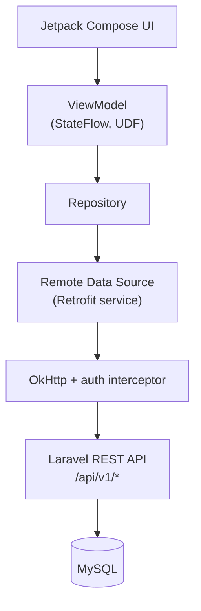
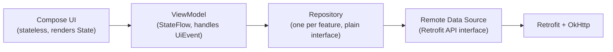

# NovaPay Android — Architecture

**Status:** proposal, written before implementation. Read alongside
`existing-system-analysis.md` (the functional spec this implements) and
`android-folder-structure.md` (the detailed package breakdown).

---

## 1. What this app is

A native Android client for the **existing** NovaPay Laravel API — the same
backend the Flutter app already talks to. No second backend, no duplicated
financial logic, no invented endpoints.

The backend remains the sole financial authority: balances, transfer
validity, idempotency enforcement, and locking all happen server-side (see
`existing-system-analysis.md` §3–§9). The Android app's job is UI, local
session/app state, API communication, secure token handling, and rendering
whatever the backend returns — never recomputing a balance or deciding a
transfer is valid on-device.

---

## 2. Technology stack, with exact versions

The brief requires "current stable versions after checking official Android
documentation," not versions guessed from training data. Every version below
was checked against an official source (developer.android.com,
kotlinlang.org, or the library's own Maven coordinates) on 2026-09-02; the
ones cross-checked with a second source are marked ✓✓.

| Concern | Choice | Version | Source |
|---|---|---|---|
| Language | Kotlin | **2.4.10** | kotlinlang.org release docs |
| Build | Android Gradle Plugin | **9.3.0** | developer.android.com/build/releases/agp-9-3-0-release-notes ✓✓ (fetched directly) |
| Build | Gradle wrapper | **9.5** (AGP 9.3.0's required minimum *and* default) | same, official release notes |
| Build | JDK | **17** (AGP 9.3.0's stated requirement) | same |
| Platform | `compileSdk` / `targetSdk` | **36** (Android 16) — Google Play's mandatory floor from Aug 31 2026 | developer.android.com/google/play/requirements/target-sdk |
| Platform | `minSdk` | **26** (Android 8.0) — see §2.1 for reasoning | project decision |
| UI | Jetpack Compose BOM | **2026.08.00** | developer.android.com/jetpack/androidx/releases/compose (Android Developers Blog, Aug 2026 release) |
| UI | Compose Compiler | via the `org.jetbrains.kotlin.plugin.compose` Kotlin Gradle plugin, version-locked to Kotlin 2.4.10 (no separate compiler-extension version to manage — this has been the model since Kotlin 2.0) | kotlinlang.org |
| UI | Material 3 | from the Compose BOM (~1.4.0) | developer.android.com/jetpack/androidx/releases/compose-material3 |
| Navigation | Navigation Compose | **2.9.8** | developer.android.com/jetpack/androidx/releases/navigation |
| State | Lifecycle (`viewmodel-compose`, `runtime-compose`) | **2.11.0** | developer.android.com/jetpack/androidx/releases/lifecycle |
| Concurrency | kotlinx-coroutines-core/android | **1.11.0** | Kotlin/kotlinx.coroutines releases |
| Networking | Retrofit | **3.0.0** | square/retrofit releases |
| Networking | OkHttp (+ logging-interceptor) | **4.12.0** | bundled/required by Retrofit 3.0.0 |
| Serialization | kotlinx-serialization-json | **1.11.0** | Kotlin/kotlinx.serialization releases |
| Networking | retrofit2-kotlinx-serialization-converter | **1.0.0** | Jake Wharton's converter artifact (stable since 2023, Converter.Factory contract unchanged) |
| Secure storage | androidx.security:security-crypto | **1.1.0** | developer.android.com/jetpack/androidx/releases/security |
| Local prefs (non-sensitive) | androidx.datastore:datastore-preferences | **1.2.1** | developer.android.com/jetpack/androidx/releases/datastore |
| Testing | JUnit 5 (Jupiter), MockK, Turbine, kotlinx-coroutines-test | latest stable at implementation time — see `testing-plan.md` §1 for why these are pinned at setup rather than in this document | — |

### 2.1 Why `minSdk = 26`

Android 8.0 (API 26, released 2017) is the floor. Reasoning:

- `androidx.security:security-crypto`'s `EncryptedSharedPreferences` and the
  `MasterKey`/Keystore APIs this app depends on for token storage work
  correctly from API 23, so 26 isn't a hard requirement of the security
  library — it's a deliberate, slightly more conservative floor for a
  **financial** app: API 26+ guarantees the Keystore's `KeyGenParameterSpec`
  behavior is consistent across OEMs (pre-26 Keystore implementations had
  more fragmentation/bugs across vendors), and StrongBox-backed keys (where
  the device has a secure element) become available from API 28 and degrade
  gracefully on 26–27.
- By 2026, API 26+ covers the overwhelming majority of active devices; the
  Android versions this excludes are not devices a security-conscious
  fintech product should be optimizing distribution for at the cost of a
  weaker Keystore story.
- This is a judgment call, not a hard technical requirement — documented here
  so it can be revisited if real device-distribution data says otherwise.

### 2.2 Why Retrofit + OkHttp + kotlinx.serialization (not Ktor, not Volley, not raw HttpURLConnection)

- **Retrofit + OkHttp** is the same category of tool the Flutter app uses
  (`dio`, also OkHttp-adjacent in spirit — an interceptor-based HTTP client
  with a declarative request layer on top). It's the most widely adopted,
  best-documented combination for a REST/JSON Android client, with first-class
  interceptor support that maps directly onto what `AuthInterceptor` does in
  Flutter (§5 of `authentication-flow.md`).
- **kotlinx.serialization** over Gson/Moshi: it's JetBrains' own solution,
  works with Kotlin `data class`es with zero reflection at runtime (better
  cold-start and R8/ProGuard behavior than reflection-based Gson), and — most
  concretely for this project — the same DTOs can be unit-tested in a
  **plain Kotlin/JVM module with no Android dependency at all**, which
  matters for this specific build environment (§4).
- Nothing here is chosen "because it's popular" — each has a specific reason
  tied either to matching the reference app's shape or to a concrete
  technical property (testability, cold start, no reflection).

### 2.3 Why Jetpack DataStore for Settings, not Room

Settings in the reference app is four booleans, written through
`SharedPreferences` via `LocalStorageService.cacheJson` (§2.5 of
`existing-system-analysis.md`). There is no relational data, no querying, no
backend sync (`SettingsRepositoryImpl` never touches the network — confirmed
in the source). Room would be pure over-engineering for four key-value flags;
`DataStore<Preferences>` is the direct, idiomatic Android analogue of
`SharedPreferences` (with the important upgrade of being Flow-based and
avoiding SharedPreferences' synchronous-I/O-on-main-thread footgun). **Room is
not used anywhere in this app** — there is no feature whose data needs
relational local persistence, offline querying, or complex local joins. See
`security.md` §4 for what *is* cached locally and why.

---

## 3. Layering — how many layers, and why

**There is no `UseCase`/interactor layer.** Every operation this app performs
is a single repository call — "log in," "get the default wallet," "submit a
top-up." A use-case class wrapping a single one-line repository call adds a
file, an interface, and a DI binding for zero behavioral benefit; the brief
itself says not to do this ("Do not create use-case classes for every trivial
one-line operation"). If a future feature genuinely needs to *combine*
multiple repository calls with real orchestration logic (none currently do —
even Transfer's multi-step UI is one API call, `POST /transfers`, with the
orchestration happening server-side), a use-case class is added for that
specific operation, not speculatively for all of them.

**Repository, not "just call Retrofit from the ViewModel," because:**
1. It's the seam tests replace with a fake — `TopUpViewModelTest` never
   needs a running server or MockWebServer, only a fake `TopUpRepository`.
2. It's where the raw Retrofit `Response<T>`/exception is translated into
   the app's own `Result<T, AppError>` shape (see `api-integration.md` §3) —
   a ViewModel should never see a `retrofit2.HttpException` or a Retrofit
   `Response` object directly, mirroring how the Flutter reference confines
   `DioException` handling to exactly one place (`ApiClient._mapError`).
3. It's the natural place to hold anything that isn't purely "translate this
   HTTP call" — e.g. the token write-after-login-response step, or (later,
   if ever needed) response caching.

**Remote Data Source is a thin Retrofit interface**, not a class with logic —
it exists as its own layer only because Repository implementations
sometimes need to combine *more than one* data source (e.g., a repository
reading from both network and local secure storage, like
`AuthRepositoryImpl` reading the network response and writing the token).
Where a repository only ever talks to one Retrofit interface, that interface
is injected directly — there is no empty pass-through wrapper class invented
just to have a "layer."

---

## 4. A build-environment constraint that shaped one architectural decision

**This matters and is disclosed here rather than glossed over.** The
container this Android project is being developed in has JDK 21 and Gradle
8.14.3 installed, but:

- **No Android SDK is installed** (no `sdkmanager`, no `ANDROID_HOME`).
- **`dl.google.com` — Google's Maven repository, which hosts every AndroidX
  artifact, Jetpack Compose, and the Android Gradle Plugin itself — is
  blocked by this session's organizational egress policy** (verified: a
  direct request returns `403 Forbidden`, and the proxy's own diagnostic
  explicitly says "do not retry or route around it — report the blocked
  host"). Maven Central (`repo1.maven.org`) **is** reachable.

Practical consequence: a full `:app` Android/Compose module — which needs
AGP, AndroidX, and the Android SDK platform — **cannot be compiled or run in
this environment**, only on a machine with normal internet access (e.g. the
developer's own machine with Android Studio, or a CI runner with the usual
Google Maven access). This is disclosed prominently in `testing-plan.md` §1
and in the final verification checklist — nothing in this project claims a
`:app` build was run here when it wasn't.

**What this changed about the design, for the better, independent of the
constraint:** all request/response DTOs, the idempotency-key policy, the
currency formatter, and the HTTP error mapper are placed in a plain
`core-domain` Gradle module — `kotlin("jvm")`, not
`com.android.library` — with a dependency graph limited to Kotlin stdlib,
kotlinx.serialization, kotlinx.coroutines-core, and Retrofit/OkHttp (all on
Maven Central, none on Google's Maven). This module is exactly the
highest-risk, must-be-correct part of a fintech client — the part that
decides "is this the same top-up request or a new one," "does this HTTP
status mean show a retry button or send the user to Login," "is
₩12,345 formatted correctly" — and it is fully compilable and unit-testable
in *this* environment via plain `./gradlew :core-domain:test`, with real,
passing JUnit results, not merely reviewed by eye. See
`android-folder-structure.md` §3 and `testing-plan.md` §1–2 for exactly
which module owns what and what was actually run versus what requires a
normal internet connection to verify.

This module boundary (pure-Kotlin domain/business-rule module, separate from
the Android/Compose presentation module) is good architecture on its own
merits — it's a common, well-regarded pattern independent of any build
constraint — and it happens to align with what this sandbox can prove.
Both things are true; neither is used to paper over the other.

---

## 5. What the backend remains responsible for (never duplicated on Android)

Per the brief's "most important rule," restated concretely against this
codebase:

| Responsibility | Owner | Evidence |
|---|---|---|
| Password verification | Laravel (`Hash::check`) | `AuthController::login` |
| Wallet ownership / scoping to the authenticated user | Laravel (`$request->user()->wallets()`) | every `WalletController`/`TransactionController` method |
| Balance arithmetic | Laravel, inside `DB::transaction()` with row locks | `TopUpController::store`, `TransferController::store` |
| Self-transfer / recipient-exists / same-currency / sufficient-balance rules | Laravel | `TransferController::store` |
| Idempotency enforcement (the actual guarantee, not just "don't double-tap") | Laravel + MySQL `UNIQUE(idempotency_key, type)` | migration `2026_08_29_085448_make_idempotency_key_unique_per_type.php` |
| Concurrency safety (`SELECT ... FOR UPDATE`, deadlock-safe lock ordering) | Laravel | `TransferController::store` |

Android's job on every one of these: **send the right request, and render
whatever comes back — success or the specific error.** It never
pre-computes "you have insufficient balance" from a possibly-stale cached
number and blocks the request client-side as if that were the source of
truth (a disabled button for an empty/zero amount is a UX nicety, not a
balance check — the real check happens server-side on every submit
regardless).
