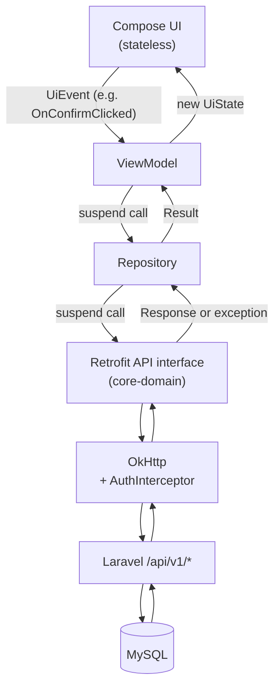

# NovaPay Android — Data Flow & State Management

Companion to `android-architecture.md` §3 (why these layers exist) — this
document is the concrete mechanics: exactly what a request/response cycle
looks like end to end, and exactly how a screen represents loading/success/
error/empty/retry/validation/navigation.

---

## 1. End-to-end request flow



The exact number of layers is deliberately small (`android-architecture.md`
§3 explains why there's no use-case layer). Every arrow above is a real,
traceable call in the codebase — there is no hidden global event bus, no
"magic" reactive pipeline a reader has to reverse-engineer.

### 1.1 Worked example: submitting a top-up

1. User taps "Confirm Top-up" → the composable calls
   `viewModel.onEvent(ConfirmTopUpEvent.Submit)`.
2. `TopUpViewModel` sets `_uiState.value = uiState.value.copy(isSubmitting = true)`
   (this is the exact bug from the Flutter reference — `submitting` was set
   to `false` and never flipped `true` — that Android fixes; see
   `topup-flow.md` §3).
3. `TopUpViewModel` calls `topUpRepository.submitTopUp(amount, currency, method, idempotencyKey)`.
4. `TopUpRepositoryImpl` calls `topUpApi.submitTopUp(TopUpRequest(...))` (a
   `suspend` Retrofit call).
5. Retrofit serializes the request via kotlinx.serialization, OkHttp sends
   it with the `AuthInterceptor`-attached `Authorization: Bearer` header.
6. Laravel processes it (see `existing-system-analysis.md` §8) and returns
   `201`/`200 {transaction}` or a `4xx`/`5xx`.
7. `TopUpRepositoryImpl` catches any `HttpException`/`IOException`, maps it
   through `core-domain`'s `ErrorMapper` into `AppError`, and returns
   `Result.success(TransactionDto)` or `Result.failure(AppError)` — the
   ViewModel never sees a Retrofit type.
8. `TopUpViewModel` updates `_uiState` to either a one-off "navigate to
   result" event (§3 below) or an error state the screen renders inline.

---

## 2. State shape: `UiState` + `UiEvent`, unidirectional

Every screen with meaningful state follows the same shape (mirrors the
Flutter reference's `XState` + `copyWith`/`StateNotifier` pattern, translated
to Compose idioms):

```kotlin
data class TopUpUiState(
    val amount: String = "",
    val currency: Currency = Currency.USD,
    val methods: List<PaymentMethod> = emptyList(),
    val selectedMethod: PaymentMethodType? = PaymentMethodType.LinkedBank,
    val methodsLoadState: LoadState = LoadState.Loading,
    val isSubmitting: Boolean = false,
    val fieldError: String? = null,          // inline validation, e.g. "Enter an amount"
    val idempotencyKey: String = UUID.randomUUID().toString(),
)

sealed interface LoadState {
    data object Loading : LoadState
    data object Idle : LoadState
    data class Error(val error: AppError) : LoadState
}

sealed interface TopUpEvent {
    data class AmountChanged(val raw: String) : TopUpEvent
    data class CurrencySelected(val currency: Currency) : TopUpEvent
    data class MethodSelected(val method: PaymentMethodType) : TopUpEvent
    data object RetryLoadMethods : TopUpEvent
    data object Submit : TopUpEvent
}
```

- `UiState` is exposed as `StateFlow<TopUpUiState>` — Compose collects it
  with `collectAsStateWithLifecycle()`.
- `UiEvent` is a closed (`sealed interface`) set of things the *user* did;
  the ViewModel's `onEvent(event)` is the only entry point that mutates
  state — a composable never sets state directly, it only emits events and
  renders whatever `UiState` says. This is the "no business logic inside a
  composable" rule from the brief, made structural rather than just a
  convention to remember.

### 2.1 Loading / Success / Error / Empty / Retry, concretely

| Concept | How it's represented | Example screen |
|---|---|---|
| Loading | A `LoadState.Loading` field on `UiState`, or (for a full-screen fetch, e.g. the wallet list) the whole `UiState` is itself a sealed type `WalletUiState.Loading / .Content(...) / .Error(...)` | `WalletViewModel` |
| Success | `UiState.Content(data)` or plain populated fields | all |
| Error | `LoadState.Error(appError)` carries the mapped `AppError` (never a raw exception); the composable renders `core/error/ErrorPresentation.kt`'s text for it | all |
| Empty | A distinct state, not "Content with an empty list treated the same as loading" — e.g. `TransactionListUiState.Content(items = emptyList())` renders an explicit "No transactions yet" composable, matching the Flutter reference's identical empty-state text | `feature/transactions` |
| Retry | Every `LoadState.Error` render includes a "Retry" action wired to the same event that triggered the original load (`RetryLoadMethods` above) — never a dead-end error screen | `feature/topup`, `feature/wallet` |
| Form validation | Client-side validation is **presentational only** (non-empty amount, valid email format for recipient search) — it never substitutes for a server check (e.g., never "insufficient balance" client-side); it exists purely so a button isn't enabled for an obviously-incomplete form. Represented as `fieldError: String?` on the relevant `UiState`, cleared on the next edit | `feature/auth`, `feature/transfer` |

---

## 3. One-off effects: navigation and snackbars

`StateFlow` is for state that a screen re-renders identically no matter how
many times it's read (Compose recomposition, configuration change). It is
**not** appropriate for "navigate to the result screen" or "show this
snackbar once" — those are events that must fire exactly once, or a
configuration change (rotation) would re-fire them from stale state.

These use a `Channel`-backed `Flow` (`viewModel.effect: Flow<TopUpEffect>`),
collected in the composable via `LaunchedEffect`:

```kotlin
sealed interface TopUpEffect {
    data class NavigateToResult(val transaction: TransactionDto) : TopUpEffect
    data class ShowError(val message: String) : TopUpEffect
}
```

This directly mirrors the Flutter reference's own pattern of treating a
submitted transaction as "a one-time navigation payload, not something
`TopUpState` needs to keep carrying around afterward" (verbatim comment in
`topup_result_screen.dart`) — Compose's idiomatic equivalent of that same
idea is a `Channel`, not a `StateFlow` field that would linger after the
navigation already happened.

**Navigation itself lives in `core/navigation`**, not inside a ViewModel or a
random composable: a screen's `LaunchedEffect` collects `effect`, and calls a
`onNavigateToResult: (TransactionDto) -> Unit` callback passed down from the
`NovaPayNavGraph` composable that owns the `NavController`. A ViewModel never
holds a `NavController` reference — this is what keeps navigation logic out
of business logic and testable independently (a `TopUpViewModelTest` asserts
an effect was emitted; it never touches Navigation Compose at all).

---

## 4. Why not a single "app-wide" state store

Each feature owns its own `UiState`/ViewModel — there's no single global
`AppState` object every screen reads from, mirroring the Flutter reference's
per-feature `StateNotifierProvider`s rather than one giant provider. The only
genuinely cross-feature state is **session** (is the user logged in, who are
they) and it lives in exactly one place, `core/session/SessionState`,
injected into the two places that actually need it: the nav graph (to pick a
start destination) and `feature/profile` (to show who's logged in). This
mirrors Flutter's `authProvider` being the one provider read from multiple
features, while every other provider stays local to its feature.
