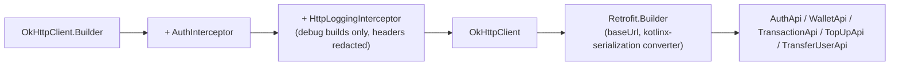

# NovaPay Android — API Integration

Covers the network layer end to end: how a request is built, how a base URL
is chosen, how every HTTP outcome maps to something a screen can render, and
what is/isn't logged. Cross-references `existing-system-analysis.md` §4 for
the endpoint contract itself — this document is about the Android-side
plumbing around that contract, not a re-statement of it.

---

## 1. Client construction (`core/network/NetworkModule.kt`)



One `OkHttpClient` and one `Retrofit` instance for the whole app, built once
as Hilt `@Singleton`s — the same "exactly one place owns HTTP setup" rule the
Flutter reference follows with its single `ApiClient`. No feature builds its
own client or adds its own interceptor.

**Timeouts**, matching the Flutter reference's `Duration(seconds: 15)`
connect/receive timeouts (`api_client.dart`):

```kotlin
OkHttpClient.Builder()
    .connectTimeout(15, TimeUnit.SECONDS)
    .readTimeout(15, TimeUnit.SECONDS)
    .writeTimeout(15, TimeUnit.SECONDS)
    .build()
```

**Content negotiation:** every request sends `Content-Type: application/json`
and `Accept: application/json` (the latter matters because Laravel's
`shouldRenderJsonWhen(fn (Request $r) => $r->is('api/*'))` — see
`existing-system-analysis.md` §3.1 — already guarantees JSON error bodies for
this API regardless, but sending `Accept: application/json` is still correct
client behavior and costs nothing).

---

## 2. Base URL per build type

The Flutter reference hardcodes `http://10.0.2.2:8000/api/v1` for the Android
emulator (`api_endpoints.dart`) with a comment explaining the emulator's
special host alias. Android does the same for local development, but as a
**Gradle build-config value**, not a hardcoded literal, so a release build
can point somewhere real without editing source:

```kotlin
// app/build.gradle.kts
buildTypes {
    debug {
        buildConfigField("String", "BASE_URL", "\"http://10.0.2.2:8000/api/v1/\"")
    }
    release {
        buildConfigField("String", "BASE_URL", "\"https://api.novapay.example/api/v1/\"")
        // Placeholder — no production Laravel deployment exists yet. Replaced
        // with the real deployed URL when one exists; never left pointing at
        // a dev machine in a release build.
    }
}
```

- **Emulator (debug):** `10.0.2.2` — the emulator's alias for the host
  machine's `localhost`, identical reasoning to the Flutter comment.
- **Physical device (debug):** `10.0.2.2` does not resolve on real hardware.
  The documented workaround (same one the Flutter developer would need) is
  to override `BASE_URL` with the host machine's LAN IP via a
  `local.properties`-sourced Gradle property, kept out of version control —
  never hardcoded into a committed file, since a LAN IP is developer-machine-
  specific and occasionally sensitive.
- **Release:** HTTPS only (§5). No cleartext fallback in a release build,
  regardless of host.

---

## 3. `AuthInterceptor`

Direct port of `auth_interceptor.dart`'s two responsibilities, with one
deliberate fix:

```kotlin
class AuthInterceptor(
    private val tokenStore: TokenStore,
    private val onUnauthorized: () -> Unit,
) : Interceptor {
    override fun intercept(chain: Interceptor.Chain): Response {
        val token = tokenStore.getTokenBlocking()
        val request = if (token != null) {
            chain.request().newBuilder()
                .addHeader("Authorization", "Bearer $token")
                .build()
        } else chain.request()

        val response = chain.proceed(request)
        if (response.code == 401) {
            tokenStore.clear()
            onUnauthorized()   // <-- actually wired, unlike Flutter's empty callback
        }
        return response
    }
}
```

**The fix:** the Flutter reference's `onSessionExpired` callback is an empty
closure (`existing-system-analysis.md` §2.5) — a 401 clears the token but
never navigates the user anywhere. Android's `onUnauthorized` is wired to
`core/session/SessionState`, which flips to `LoggedOut`; the nav graph
observes that and pops to the Login screen. This is a correctness fix to a
known, verified gap in the reference, not a scope addition — "navigate to
login on an invalid/expired token" is explicitly required by the brief's
Part 6.

---

## 4. HTTP status → `AppError` → UI behavior

`core-domain`'s `ErrorMapper` turns every network outcome into exactly one of
these (`AppError` is a `sealed interface`, so a `when` over it is
exhaustive — a ViewModel cannot forget to handle a case):

| HTTP outcome | `AppError` variant | Typical UI behavior |
|---|---|---|
| No connection / DNS failure | `Network` | "No internet connection." + Retry action |
| Connect/read/write timeout | `Timeout` | "The request timed out. Please try again." + Retry action |
| `401` | `Unauthorized` | Token cleared (already done in the interceptor), session flips to logged-out, nav graph routes to Login. A screen never renders a 401 inline — the user is simply on the Login screen by the time this would matter |
| `404` | `Http(404, message)` | User-facing message from the response body if present (e.g. "No user found with that email."), else a generic "Not found." Never a raw stack trace or path |
| `422` | `Http(422, message, fieldErrors)` | If `fieldErrors` is present, shown next to the relevant field (e.g. `errors.amount` → the amount field); the flat self-transfer shape (`existing-system-analysis.md` §4.1, no `errors` key) falls back to showing `message` as a general form error. Never both silently dropped |
| `429` (not currently returned by this backend, but mapped defensively) | `Http(429, message)` | "Too many requests, please wait a moment." |
| `5xx` | `Http(5xx, genericMessage)` | A **generic** safe message ("Something went wrong. Please try again.") — the raw server message/stack is never shown to the user, and is logged (without PII/tokens) rather than displayed, per §6 |
| Malformed/unexpected JSON shape | `Unknown` | Same generic safe message as 5xx — a parsing failure is treated as a server-contract problem, not surfaced as a crash |

This is the concrete implementation of the brief's Part 12 requirement:
"Never display sensitive backend details directly to users," and "Do not
make every ViewModel understand raw HTTP status codes" — a ViewModel's `when`
is over five sealed cases, never over an `Int` status code.

### 4.1 Defensive enum parsing

The Flutter reference's `TransactionModel.fromJson` throws `ArgumentError` on
an unrecognized `type`/`status` value (`existing-system-analysis.md` §2.5).
Android's `TransactionDto` instead deserializes an unknown `type`/`status`
into an explicit `UNKNOWN` enum constant (kotlinx.serialization
`@Serializable` enums support this via a fallback entry) rather than
crashing the whole transaction list over one row the client doesn't yet
understand — a resilience improvement, not a spec deviation, since the set
of valid values is still exactly what the backend's CHECK constraints allow
today (`existing-system-analysis.md` §3.3).

---

## 5. Network security configuration

- **Release builds:** `android:usesCleartextTraffic="false"` (the platform
  default from API 28+, made explicit) — HTTPS only, no exceptions.
- **Debug builds only:** a `network_security_config.xml` cleartext exception
  scoped to exactly `10.0.2.2` (and, if a developer overrides `BASE_URL` for
  a physical device, their LAN IP override — documented as a local, never-
  committed change) — never a blanket cleartext allowance, and never present
  in the release manifest variant at all (Android's debug/release manifest
  merging keeps this file out of a release APK entirely).
- No certificate pinning in this version — there is no production TLS
  endpoint to pin yet (§2's release `BASE_URL` is a placeholder). Documented
  as a `security.md` future item once a real deployment exists, rather than
  pinning a certificate that doesn't correspond to anything real.

---

## 6. Logging

- `HttpLoggingInterceptor` is added **only** in debug builds
  (`if (BuildConfig.DEBUG)`), exactly the guidance the Flutter reference
  leaves as a comment ("gate it behind `kDebugMode`... rather than
  always-on") but never actually implements (it's commented out entirely in
  `api_client.dart`) — Android does implement the debug-only gate.
- Even in debug, the `Authorization` header is explicitly redacted
  (`HttpLoggingInterceptor().redactHeader("Authorization")`) — a developer
  debugging a network issue should never see their own bearer token dumped
  to Logcat, since Logcat output can end up in bug reports, screen
  recordings, or crash-reporting breadcrumbs.
- Request/response **bodies** are logged in debug only at `BASIC` level
  (method, URL, status, byte count) — not `BODY` level — because request
  bodies include the user's password (login/register) and response bodies
  include wallet balances and transaction history. `BODY`-level logging is
  available as a manual, deliberate opt-in for local debugging only, never
  the default, and is called out in `security.md` §5 as a rule: **no
  financial amounts, emails, or secrets in any log line, at any log level, in
  any build type.**

---

## 7. Retries

No custom automatic-retry-on-failure logic is added beyond OkHttp's default
`retryOnConnectionFailure(true)` (retries a request automatically only on
certain low-level connection failures, before any response was received).
This is safe here specifically *because* every mutating request
(`POST /topups`, `POST /transfers`) is idempotency-keyed
(`existing-system-analysis.md` §8–§9) — an automatic retry after a dropped
connection is indistinguishable, from the backend's point of view, from a
user tapping "Confirm" again with the same key, and both are handled by the
same `UNIQUE(idempotency_key, type)` fast path. A **user-initiated** retry
(tapping "Confirm Top-up" again after seeing an error) reuses the same
`idempotencyKey` already held in `UiState` for exactly the same reason
(`android-processing-flow.md` §2, `topup-flow.md` §3).
