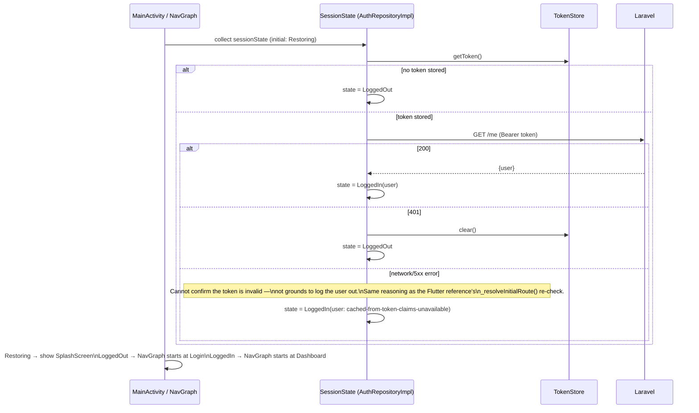
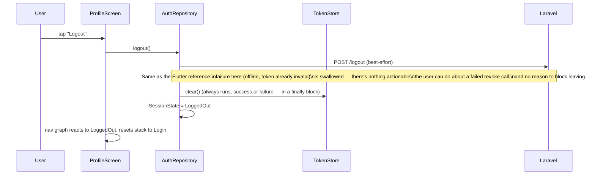

# NovaPay Android — Authentication Flow

Backend contract: `existing-system-analysis.md` §3.4, §4, §5. This document
is the Android-side implementation of that contract: exact classes, the
session state machine, and screen-level behavior. Token storage mechanics
are detailed in `security.md` §2 — this document treats `TokenStore` as a
given interface (`saveToken`, `getToken`, `clear`).

---

## 1. Session state machine

```kotlin
sealed interface SessionState {
    data object Restoring : SessionState      // app just launched, checking for a saved token
    data object LoggedOut : SessionState
    data class LoggedIn(val user: UserDto) : SessionState
}
```

Held in `core/session/SessionState` as a `StateFlow<SessionState>`, owned by
`AuthRepositoryImpl` and exposed read-only. `NovaPayNavGraph`'s root
composable collects it once to pick a start destination, and the app never
needs a second source of truth for "am I logged in" — `feature/profile`,
`core/navigation`, and the `AuthInterceptor`'s 401 handler all read/write
through this one object.

---

## 2. Startup / session restoration



**The offline/5xx case is intentionally not a hard "log out."** The Flutter
reference re-checks `secureStorageProvider.isLoggedIn` after
`restoreSession()` rather than trusting a flag, specifically so a network
blip on launch doesn't bounce a genuinely-logged-in user back to Login
(`existing-system-analysis.md` §5). Android reproduces this: only a
confirmed `401` clears the token; a connectivity failure leaves the existing
token in place and lets the user proceed — subsequent authenticated calls
that also fail will surface their own error state normally (§4 of
`api-integration.md`), without forcing a re-login for what might just be a
dropped connection. One practical difference from Flutter: since there's no
cached `User` object to show immediately in this edge case (Flutter doesn't
have one either, in fairness — its `AuthState.user` stays `null` here too),
the Dashboard's user-dependent UI (the greeting name) degrades to a neutral
placeholder until the next successful `/me`/login refreshes it, rather than
blocking navigation entirely.

---

## 3. Login

```mermaid
sequenceDiagram
    participant U as User
    participant S as LoginScreen
    participant VM as LoginViewModel
    participant Repo as AuthRepository
    participant API as Laravel

    U->>S: enter email + password, tap "Sign in"
    S->>VM: onEvent(Submit)
    VM->>VM: validate non-empty (client-side, presentational only)
    VM->>Repo: login(email, password)
    Repo->>API: POST /login
    alt 200
        API-->>Repo: {user, token}
        Repo->>Repo: TokenStore.save(token); SessionState = LoggedIn(user)
        Repo-->>VM: Result.success(user)
        VM-->>S: effect NavigateToHome
    else 401
        API-->>Repo: {message: "The provided credentials are incorrect."}
        Repo-->>VM: Result.failure(AppError.Http(401, message))
        VM->>VM: uiState.error = message
        VM-->>S: inline error shown, stay on screen
    end
```

Client-side validation before the call is limited to "is this field empty" —
exactly what `LoginScreen`'s `Form`/`validator` does in the Flutter
reference. It never tries to guess password correctness or pre-empt the
backend's answer; the 401 path above is the only source of truth for "these
credentials are wrong."

---

## 4. Register

Same shape as Login, `POST /register` instead of `/login`
(`existing-system-analysis.md` §4), landing directly in `LoggedIn` — there is
no email-verification gate in this backend. Client-side checks mirror the
Flutter reference exactly: full name / email / password non-empty, password
confirmation matches, and (new, not weakened) the backend's own `min:8`
password-length rule is also checked client-side before submitting, purely
to avoid a round trip for an error the client can already predict — the
authoritative `422` response is still what actually decides success, and its
message is shown verbatim if the backend disagrees for any reason (e.g. the
email was taken by another request in the meantime).

On success, `RegisterViewModel` follows the exact same `TokenStore.save` +
`SessionState = LoggedIn` path as Login — the backend already created both
the USD and KHR wallets for this user inside its own `DB::transaction()`
(`existing-system-analysis.md` §3.3), so there is nothing left for the
client to provision.

---

## 5. Logout



The token clear is unconditional (`try { revoke on server } finally { clear
locally }`) — a user can always log out of the device even if the server
call fails, matching `AuthRepositoryImpl.logout()`'s `try`/`catch`/`finally`
in the Flutter reference exactly.

---

## 6. Screen-level behavior summary

| Screen | Loading | Error | Success |
|---|---|---|---|
| `SplashScreen` | Shown while `SessionState == Restoring` | — (restoration failures resolve to `LoggedOut`, not an error screen) | Immediately replaced once `SessionState` resolves |
| `LoginScreen` | "Sign in" button shows a spinner and disables while `isSubmitting` | Inline text under the password field, from `AppError` message (never a raw status code) | Navigate to Dashboard, back stack cleared (`popUpTo` the graph root, `inclusive = true`) so Back never returns to Login |
| `RegisterScreen` | Same as Login | Same as Login, plus inline field errors when the backend returns `422` `errors` | Same as Login |
| `ProfileScreen` (Logout) | No spinner needed — logout is fast and always "succeeds" from the user's perspective | Not applicable (§5) | Navigate to Login, back stack cleared |

---

## 7. Security decisions referenced here

Token storage mechanism (Keystore-backed `EncryptedSharedPreferences`), why
passwords are never persisted anywhere on-device, and what is/isn't logged
during auth calls are specified once, in `security.md` §2–§3, rather than
repeated here — this document defers to that one for anything storage- or
logging-related and stays focused on the request/response/state flow.
