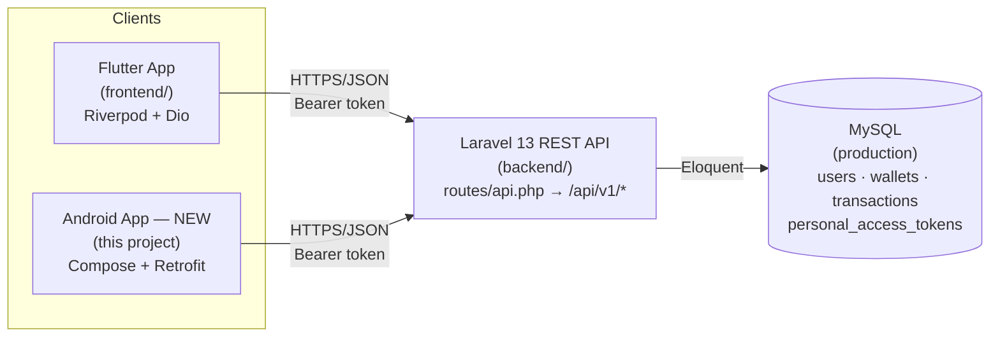
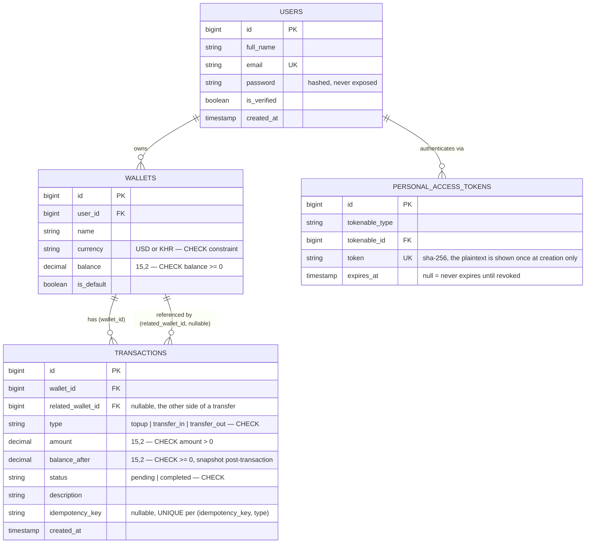
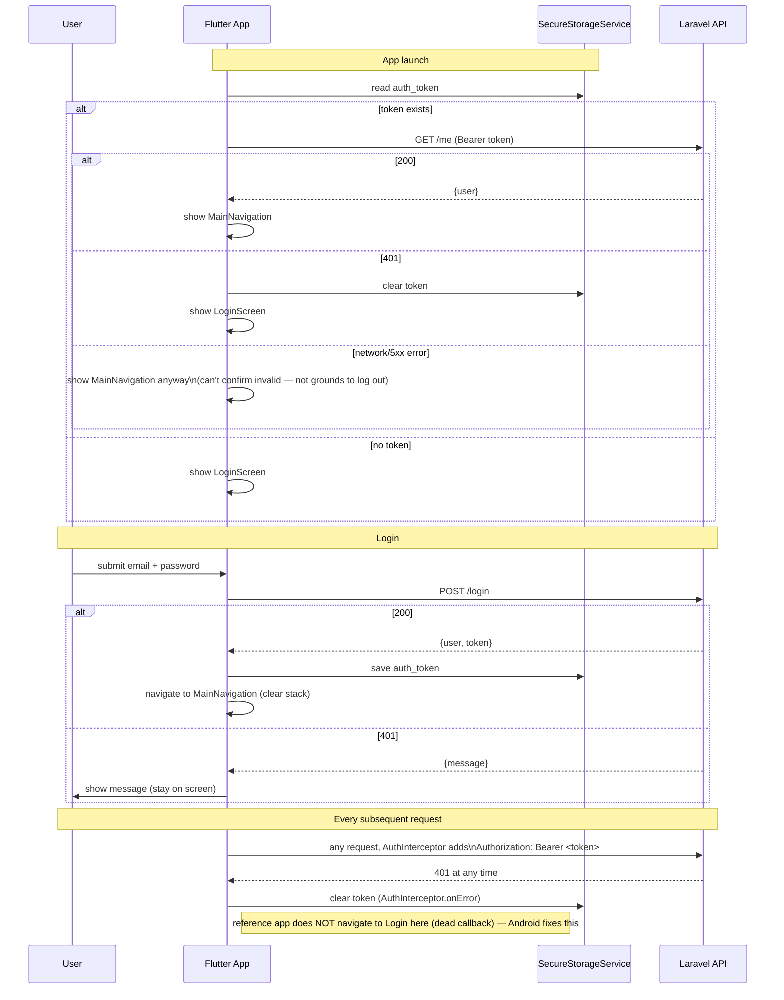
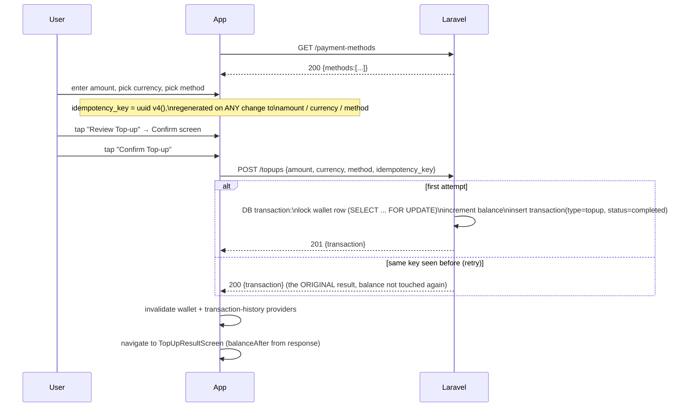

# NovaPay — Existing System Analysis

**Purpose:** This document is the functional specification for the native Android
client. Every claim below was verified by reading the actual source in this
repository (`frontend/` = Flutter app, `backend/` = Laravel API) on 2026-09-02 —
nothing here is inferred from README files, planning documents, or naming
conventions alone. Two documents that *look* authoritative are explicitly
**not** trusted as ground truth and are called out below.

> **Stale documents in this repo.** `frontend/SESSION_HANDOFF.md` (dated
> 2026-08-07) describes the app as a "frontend-only prototype" with no real
> backend. `frontend/novapay-backend-plan.md` describes a much larger planned
> schema (cards, linked_accounts, disputes, documents, notification_settings,
> withdraw). **Neither is true of the code as it exists today.** A real
> Laravel + Sanctum + MySQL backend exists and several Flutter features are
> already wired to it; the planned schema was never fully built — only
> `users`, `wallets`, `transactions`, and Sanctum's `personal_access_tokens`
> exist. This document supersedes both for anything they disagree on.

---

## 1. System Overview



Both clients are peers that consume the **same** backend. The Android app
introduces no new backend, no new tables, and no new business rules — it is a
second presentation layer over the system that already exists.

---

## 2. Existing Flutter Architecture

### 2.1 Stack (from `frontend/pubspec.yaml`)

| Package | Version | Actually used? |
|---|---|---|
| `flutter_riverpod` | ^2.6.1 | Yes — sole state management (`StateNotifier`/`StateNotifierProvider`), uniformly |
| `dio` | ^5.9.0 | Yes — the only HTTP client, wrapped by `ApiClient` |
| `flutter_secure_storage` | ^9.2.2 | Yes — auth token persistence (`SecureStorageService`) |
| `shared_preferences` | ^2.3.2 | Yes — non-sensitive local prefs (`LocalStorageService`), backs Settings |
| `uuid` | ^4.6.0 | Yes — idempotency key generation (`Uuid().v4()`) |
| `intl` | ^0.20.3 | Yes — currency/date formatting |
| `go_router` | ^16.0.0 | **No** — declared, zero imports anywhere. Navigation is 100% `Navigator.push`/`MaterialPageRoute` |
| `local_auth` | ^2.3.0 | **No** — declared, unused. The "Biometric Login" Settings toggle persists a bool but never calls this package |
| `freezed_annotation`, `json_annotation` | ^3.1.0 / ^4.9.0 | **No** — declared, no generated code exists; all models hand-written |

### 2.2 Folder structure

```
frontend/lib/
├── app/                     # shell: constants (AppColors), main_navigation.dart
│                             # router.dart, app.dart, environment.dart are 0-byte dead files
├── core/
│   ├── network/             # ApiClient (Dio wrapper), ApiEndpoints, AuthInterceptor
│   ├── storage/              # SecureStorageService (token), LocalStorageService (prefs)
│   ├── errors/               # ApiException (one error type for the whole app)
│   ├── providers/            # root Riverpod providers (apiClientProvider, etc.)
│   └── mock/                 # dead leftover mock data, superseded by real providers
├── features/<name>/
│   ├── domain/
│   │   ├── entities/         # plain Dart classes, no JSON knowledge
│   │   └── repositories/     # abstract interface
│   ├── data/
│   │   ├── model/             # entity subclass + fromJson
│   │   ├── datasource/        # talks to ApiClient, returns models
│   │   └── repositories/      # implements the domain interface
│   └── presentation/
│       ├── provider/          # StateNotifier + StateNotifierProvider
│       ├── screen/             # full-page widgets
│       └── widget/             # feature-local reusable widgets
└── shared/
    ├── widgets/                # promoted once used by 2+ features
    └── utils/                  # NameInitials, AvatarColor, CurrencyFormatter extensions
```

Nine feature folders exist: `authentication`, `dashboard`, `wallet`,
`transactions`, `topup`, `transfer`, `notifications`, `profile`, `settings`,
plus a tenth, `fraud`, that is **100% mock** (see §7).

### 2.3 State management pattern

Every feature follows the same shape: an immutable `XState` class with a
`copyWith`, and an `XNotifier extends StateNotifier<XState>` that talks to a
repository and assigns a new `state`. Screens are `ConsumerWidget`/
`ConsumerStatefulWidget`s that `ref.watch` the state and call notifier methods
on user action. There is no business logic inside a widget's `build()` method
beyond picking which state to render.

### 2.4 Navigation

Not `go_router` (declared, unused). Two patterns:

1. **Bottom tabs** (`app/main_navigation.dart`): a `PageView` + custom
   `CustomBottomNavigation` bar, 4 dense tab indices — Home(0) / Wallet(1) /
   Transfer(2) / Profile(3). Swiping and tapping both work. A center "+"
   button exists visually but is commented out / wired to an empty callback —
   it does nothing.
2. **Stack navigation** for everything else: `Navigator.push(MaterialPageRoute(...))`
   for drill-in screens (Top-up, Transfer sub-screens, Transaction Detail,
   Notifications, Settings), and `Navigator.pushAndRemoveUntil(..., (route) => false)`
   to reset the stack after login/logout/"Back to Home" from a result screen
   (deliberately prevents back-navigation into a completed money-movement flow).

### 2.5 Known gaps in the reference app (do not blindly copy these)

These are real, verified issues in the current Flutter code. They matter
because the Android app is expected to reproduce *behavior*, not *bugs* —
each is called out explicitly wherever it affects an Android design decision:

| Gap | Where | Effect |
|---|---|---|
| `submitting` flag is set to `false` at the start of `submit()`, never `true` | `topup_provider.dart:118`, `transfer_provider.dart:84` | The loading spinner/disabled state on "Confirm Top-up"/"Confirm Transfer" never actually activates during the real network call — a live double-submit risk, mitigated only by backend idempotency |
| `onSessionExpired` callback is an empty closure | `core_providers.dart:33-36` | A 401 clears the token but never navigates the user to the login screen — they'd sit on a dead screen until manually restarting the app |
| Transaction list ignores server pagination `meta` | `transaction_history_provider.dart`, `BalanceOverviewScaffold` | Only page 1 (≤20 rows) is ever fetched; `last_page`/`total` are discarded, no "load more" |
| `api_endpoints.dart` contains paths with no backend route | `/settings`, `/transactions/{id}`, `/transactions/{id}/report`, `/fraud-alerts/*` | Dead/aspirational constants, never actually reachable |
| `TransactionModel.fromJson` throws `ArgumentError` on an unrecognized `type`/`status` | `transaction_model.dart` | A future server-side enum addition would crash the list instead of degrading gracefully |

---

## 3. Existing Laravel Architecture

### 3.1 Stack (from `backend/composer.json`)

- **Laravel 13.8**, PHP ^8.3
- **Laravel Sanctum 4.0** — token-based auth (`personal_access_tokens` table),
  used purely as a bearer-token issuer for native/mobile clients. There is no
  SPA cookie flow involved for this API.
- **MySQL** in production (per project description); `sqlite` is only the
  local `.env.example` default for `php artisan serve` convenience.
- Money stored as `decimal(15,2)` everywhere — never float.
- Every money-moving write wrapped in `DB::transaction()`.
- JSON shaped exclusively through **Laravel API Resources** (`UserResource`,
  `WalletResource`, `TransactionResource`) — the response shape is
  intentional, not "whatever Eloquent returns."
- `bootstrap/app.php` forces JSON error rendering for every `api/*` request
  (`shouldRenderJsonWhen`), so even a framework-level exception (404 route,
  500) comes back as JSON, never an HTML error page.

### 3.2 Folder structure (only what exists — not the full plan doc)

```
backend/
├── app/
│   ├── Models/               User, Wallet, Transaction
│   ├── Http/
│   │   ├── Controllers/Api/V1/   AuthController, WalletController,
│   │   │                          TransactionController, TopUpController,
│   │   │                          TransferController, UserController
│   │   ├── Requests/              LoginRequest, RegisterRequest,
│   │   │                          StoreTopUpRequest, StoreTransferRequest
│   │   └── Resources/             UserResource, WalletResource, TransactionResource
├── database/
│   ├── migrations/            users, wallets, transactions, personal_access_tokens,
│   │                           + currency column, + idempotency_key column
│   └── factories/             UserFactory, WalletFactory, TransactionFactory
├── routes/api.php             all routes, prefixed /api/v1
└── tests/Feature/             AuthTest, WalletTest (real, passing, assert exact JSON shapes)
```

No `Services/`, `Cards`, `LinkedAccounts`, `Disputes`, `Documents`, or
`NotificationSettings` exist. `FraudCheckService` was never built.

### 3.3 Database schema (actual, from migrations)



Key constraints enforced **at the database level** (not just app-level
validation) — the Android app must never assume it can bypass these by
calling the API differently:

- `wallets`: `UNIQUE(user_id, currency)` — a user can have at most one USD and
  one KHR wallet. `CHECK (balance >= 0)` — a wallet can never go negative,
  even under a race.
- `transactions`: `CHECK (type IN ('topup','transfer_in','transfer_out'))`,
  `CHECK (amount > 0)`, `CHECK (balance_after >= 0)`,
  `CHECK (status IN ('pending','completed'))`,
  `UNIQUE(idempotency_key, type)` — this last one is what makes retried
  top-ups/transfers safe (§6, §9).

### 3.4 Authentication (Sanctum)

- `config/auth.php` default guard is `web` (session), but every API route
  used by a mobile client goes through the `auth:sanctum` middleware, which —
  for a request carrying `Authorization: Bearer <token>` and no session
  cookie — authenticates via Sanctum's `PersonalAccessToken` lookup. There is
  **no CSRF, no cookie, no "stateful domain" concern for a native client**;
  that machinery in `config/sanctum.php` exists only for the (unused, for
  this app) first-party-SPA cookie flow.
- Tokens are **opaque, long-lived personal access tokens** — `'expiration' =>
  null` in `config/sanctum.php`. There is no refresh-token endpoint and no
  token expiry to plan around; a token is valid until the user logs out
  (`DELETE`s their `currentAccessToken()`) or an admin revokes it directly in
  the database. (The Flutter `SecureStorageService` has a `refreshToken` slot
  — it is **never populated**; the backend has nothing to put there. The
  Android app must not invent a refresh flow either.)
- `POST /login` returns the **same generic message** for "no such user" and
  "wrong password" (`"The provided credentials are incorrect."`, HTTP 401) —
  a deliberate anti-enumeration measure. Never split this into two messages
  client-side.

---

## 4. Full API Contract (verified against `routes/api.php`, controllers, Form Requests, Resources, and `tests/Feature/*`)

Base path: **`/api/v1`**. All endpoints below except register/login return
JSON; all authenticated endpoints require `Authorization: Bearer <token>` and
`Accept: application/json`.

| Method & Path | Auth | Request body / query | Success | Failure modes |
|---|---|---|---|---|
| `POST /register` | guest | `full_name, email, password, password_confirmation` | `201 {user, token, token_type:"Bearer"}` — also silently creates a USD wallet (`is_default=true`, balance 0) and a KHR wallet (`is_default=false`, balance 0) | `422` validation (`email` unique, `password` min:8+confirmed) |
| `POST /login` | guest | `email, password` | `200 {user, token, token_type}` | `401 {message:"The provided credentials are incorrect."}` (same for bad password or unknown email) |
| `GET /me` | sanctum | — | `200 {user}` | `401` no/invalid token |
| `POST /logout` | sanctum | — | `200 {message:"Logged out successfully."}`, current token deleted server-side | `401` |
| `GET /wallets` | sanctum | — | `200 {wallets:[{id,name,currency,balance,is_default}]}` — only the caller's own wallets, both currencies | `401` |
| `GET /wallets/default` | sanctum | — | `200 {wallet:{...}}` (the `is_default=true` row — USD, per registration) | `401`; `404` if somehow no default wallet exists |
| `GET /wallets/default/transactions` | sanctum | — | `200 {transactions:[...], meta:{current_page,last_page,per_page,total}}`, latest-first, 20/page | `401` |
| `GET /wallets/{currency}/transactions` | sanctum | path: `currency` = `USD`\|`KHR` | same shape as above, for that wallet | `401`; `404` if the user has no wallet in that currency |
| `GET /payment-methods` | sanctum | — | `200 {methods:[{type,title,subtitle,iconAsset}]}` — fixed list, not DB-backed: `linkedBank`, `debitCard`, `applePay` | `401` |
| `POST /topups` | sanctum | `amount, currency, method, idempotency_key` | `201 {transaction}` (first time) **or** `200 {transaction}` (idempotent replay) | `422` validation; `404` if wallet missing for currency (shouldn't happen) |
| `GET /users/search?email=` | sanctum | query: `email` | `200 {user:{id,full_name,email,is_verified}}` — exact match only | `404 {message:"No user found with that email."}`; `422` if `email` missing/invalid |
| `POST /transfers` | sanctum | `recipient_email, amount, currency, idempotency_key, note?` | `201 {transaction}` (first time, sender's `transfer_out` row) **or** `200 {transaction}` (idempotent replay) | `422 {message:"You cannot transfer to yourself."}` (flat shape, self-transfer); `404 {message:"No user found with that email."}` (recipient doesn't exist); `422 {message, errors:{currency:[...]}}` (no wallet for currency on either side); `422 {message, errors:{amount:[...]}}` (insufficient balance); `422` standard validation |

### 4.1 Two different `422` response shapes — important for error mapping

Laravel's automatic `FormRequest`/`ValidationException` failures return:
```json
{ "message": "The given data was invalid.", "errors": { "amount": ["Insufficient balance."] } }
```
But `TransferController`'s hand-written self-transfer check returns a flat
shape with **no `errors` key**:
```json
{ "message": "You cannot transfer to yourself." }
```
Any Android error mapper must treat `message` as always-present and `errors`
as optional, never assume one implies the other.

### 4.2 Response field notes

- `WalletResource`/`TransactionResource` cast `balance`/`amount`/`balance_after`
  to PHP `float` before serializing — i.e., they arrive as JSON numbers, not
  strings, despite being `decimal(15,2)` in MySQL.
- `TransactionResource` never includes the paired transaction: a transfer's
  `POST /transfers` response shows only the **sender's** `transfer_out` row.
  The recipient sees their own `transfer_in` row only when *they* list their
  own transaction history.
- Pagination (`?page=N`) is real, standard Laravel `LengthAwarePaginator`
  output — the Flutter client fetches it but discards `meta` and never
  requests page 2 (see §2.5). The Android app should not repeat this.

---

## 5. Authentication Flow (as implemented)



Registration follows the identical success path (`POST /register` instead of
`/login`), landing straight in `MainNavigation` — there is no separate
"verify your email" step gating access.

---

## 6. Wallet Flow

- A user always has **exactly two wallets** after registration: USD
  (`is_default=true`) and KHR (`is_default=false`). There is no UI to create,
  delete, or add a third wallet/currency.
- `walletProvider` (singular) = the **default** wallet (USD) — used for the
  Dashboard's top balance card.
- `walletsProvider` (plural) = both wallets — used wherever the user can pick
  a currency (Wallet screen's currency chip, Transfer's source-currency
  picker).
- Currency selection is **local UI state only** (`_selectedCurrency` in
  `WalletScreen`, `state.currency` in `TransferState`/`TopUpState`) — picking
  KHR does not call a different "switch active wallet" endpoint; it simply
  changes which wallet's fields are read/which currency is sent on the next
  write request.
- Effect of the selected currency, precisely:
  - **Balance display** → read from the matching entry in `walletsProvider`.
  - **Transaction history** → `GET /wallets/{currency}/transactions` instead
    of the default-wallet endpoint.
  - **Top-up** → `currency` field in the `POST /topups` body; also resets the
    quick-amount chips (USD: 25/50/100/250, KHR: 20000/50000/100000/200000)
    and the idempotency key.
  - **Transfer** → `currency` field in `POST /transfers`; the backend
    resolves **both** sender's and recipient's wallet for that currency
    independently — a same-currency requirement enforced server-side, not
    client-side (§9).

---

## 7. Transaction History Flow

- Two read endpoints, one shape (`transactions[]` + `meta`), described in §4.
- Both the Dashboard's "Recent Activity" and the Wallet screen's "Transaction
  History" render through the **same shared widget**
  (`BalanceOverviewScaffold` → `CustomTransactionHistoryItem`), driven by
  `transactionHistoryProvider` (default wallet) or
  `walletTransactionsProvider(currency)` (family provider, selected wallet).
- Row rendering rules (verified in `CustomTransactionHistoryItem` and
  `TransactionDetailScreen`):
  - `type: topup | transfer_in` → **income** (green, `+` sign); `transfer_out`
    → **expense** (red, `-` sign). This is a pure function of `type`, never
    of the raw signed amount (the API never sends a negative amount).
  - Title = `description` if present, else a type-derived fallback ("Top Up"
    / "Transfer In" / "Transfer Out").
  - `status: pending` → amber "Pending" badge; `completed` → green
    "Completed" badge. (In practice every transaction the current backend
    creates is `status: completed` immediately — `pending` is modeled in the
    schema/CHECK constraint but no code path produces it yet.)
  - `balance_after` is shown verbatim on Result screens as the new balance —
    **never recomputed client-side** from the transaction list.
- Pagination is real server-side but unused by the Flutter client (see §2.5)
  — the Android app implements it properly since Part 8 of the brief calls
  for "pagination behavior where the API already supports it."

---

## 8. Top-up Flow



**Payment methods are cosmetic.** `TopUpController::PAYMENT_METHODS` is a
hardcoded PHP array, not a database table — there is no real payment
processor integration. Selecting "Apple Pay" does not talk to Apple; it is
just a string (`method: "applePay"`) the backend accepts and echoes back into
the transaction's `description`. The Android app must not imply a real
payment rail is involved beyond what the backend actually models.

**Idempotency key lifecycle** (from `TopUpNotifier`, exactly what Android
reproduces):
- One key is minted (`uuid.v4()`) the moment the top-up flow's state is
  created.
- The key is regenerated whenever `amount`, `currency`, or `method` changes —
  i.e., whenever the request body *would* change.
- The key is **not** regenerated when `submit()` fails (network error, 422,
  5xx) — the next tap of "Confirm Top-up" reuses the same key, so a retry
  after a failure is safe: if the first attempt actually succeeded
  server-side despite the client seeing an error (timeout, dropped
  connection), the retry hits the `UNIQUE(idempotency_key, type)` fast path
  and gets the original result back instead of double-charging.
- A concurrent double-tap that races past the client-side "same key" check is
  still safe: the loser's insert hits the DB unique constraint (MySQL error
  1062), its whole `DB::transaction()` (including the balance increment)
  rolls back, and the controller catches that specific error to return the
  winner's transaction instead of a 500.

---

## 9. Transfer Flow

```mermaid
sequenceDiagram
    participant U as User
    participant App
    participant API as Laravel
    participant DB as MySQL

    U->>App: tap "Select recipient" → search sheet
    App->>API: GET /users/search?email=...
    alt found
        API-->>App: 200 {user}
    else not found
        API-->>App: 404 {message}
    end
    U->>App: enter amount, currency, note; Continue → Confirm
    U->>App: tap "Confirm Transfer"
    App->>API: POST /transfers {recipient_email, amount, currency, idempotency_key, note?}
    API->>API: strcasecmp(recipient_email, sender.email) == 0 ?
    alt self-transfer
        API-->>App: 422 {message:"You cannot transfer to yourself."}
    end
    API->>DB: find recipient by email
    alt not found
        API-->>App: 404 {message:"No user found with that email."}
    end
    API->>DB: Transaction where idempotency_key=X and type=transfer_out exists?
    alt yes (retry)
        API-->>App: 200 {transaction} (original result)
    end
    API->>DB: BEGIN\nresolve sender+recipient wallet ids for currency
    alt either wallet missing
        API-->>App: 422 {errors:{currency:["Wallet not found for the selected currency."]}}
    end
    API->>DB: SELECT ... FOR UPDATE\nboth wallets, ORDER BY id (deadlock-safe lock order)
    alt sender balance < amount
        API-->>App: 422 {errors:{amount:["Insufficient balance."]}}
    end
    API->>DB: decrement sender, increment recipient\ninsert transfer_in (recipient)\ninsert transfer_out (sender)\nCOMMIT
    API-->>App: 201 {transaction} (sender's transfer_out row)
    App->>App: invalidate wallet(s) + transaction-history providers
    App->>App: navigate to TransferResultScreen
```

Business rules enforced **only** by the backend (Android must never
re-implement or pre-validate these beyond basic UX affordances like
disabling a button for an empty amount):

1. **Self-transfer rejection** — case-insensitive email compare.
2. **Recipient must exist** — exact-email lookup via `GET /users/search`,
   re-verified server-side at submit time too (a recipient could vanish
   between search and submit; the backend is the final word).
3. **Same-currency requirement** — both sender and recipient must have a
   wallet in the chosen currency. Since every user gets both USD and KHR at
   registration, this only fails in edge cases (e.g. data corruption), but
   Android must still surface the `currency` validation error if it happens
   rather than assume it can't.
4. **Insufficient balance** — checked with row locks held, immediately before
   the debit, not against a possibly-stale client-side balance.
5. **Deadlock-safe locking** — both wallets are locked in a consistent
   `ORDER BY id` regardless of who is sender/recipient, so two concurrent
   transfers between the same two users in opposite directions can't
   deadlock each other.
6. **Idempotency**, identical mechanism to top-up, keyed on
   `(idempotency_key, type='transfer_out')`. The Flutter `TransferNotifier`
   regenerates the key on any change to `recipient`, `amount`, `currency`, or
   `note`, and keeps it stable across a failed-then-retried submit — Android
   reproduces the same granularity.

---

## 10. Notification "Flow" — not a real backend feature

There is **no notifications endpoint** anywhere in `routes/api.php`. The
Flutter Notifications screen is two unrelated things glued into one tabbed
UI:

1. **"Alerts" tab** — `mockAlertNotifications`, a hardcoded, compile-time
   constant list (payment declined, new device sign-in, one fraud alert).
   Nothing server-side generates these; they are identical for every user,
   every session.
2. **"Transactions" tab** — not a separate API call at all; it's the same
   `transactionHistoryProvider` data (§7) re-rendered as notification tiles
   client-side (`AppNotification.fromTransaction`), always marked
   `isRead: true`.

The unread badge on the bell icon counts only unread items from the hardcoded
alert list — real transactions never contribute to it.

**Decision for Android:** reproduce the "Transactions" tab (it's real data,
derived client-side from an endpoint that already exists) and **omit** the
mock "Alerts" tab and the Fraud Alert screen entirely — inventing a fake
alerts feed or a fake fraud-dispute API would violate the brief's explicit
instruction not to duplicate or fabricate backend authority. This is
reassessed if/when the backend ever grows a real notifications or fraud
endpoint.

---

## 11. Flutter Features With No Backend Counterpart (excluded from Android v1)

Verified by grep across `backend/routes/api.php` and every controller — none
of the following have a real server endpoint, despite UI existing (in
whole or as a dead stub) in Flutter:

| Flutter feature | Where | Backend reality |
|---|---|---|
| Fraud Alert / Disputes | `features/fraud/**` | 100% mocked (`Future.delayed` + hardcoded JSON); no `disputes` table, no controller |
| Withdraw | referenced in `novapay-backend-plan.md` only | No feature folder even exists in Flutter; no endpoint |
| Settings sync (`/settings`) | dead constant in `api_endpoints.dart` | Settings is local-only (`SharedPreferences`), confirmed by `SettingsRepositoryImpl` never touching `ApiClient` |
| Cards / Linked Accounts / Documents | Profile menu rows, no `onTap` | No tables, no controllers, no routes |
| Change PIN / Change Password / 2FA | Settings menu rows, no `onTap` | No tables, no controllers, no routes |
| Transaction "Report an Issue" | stub button, `onPressed: () {}` | No route |
| "View Receipt" (Top-up/Transfer result) | stub button, `onPressed: () {}` | No route |

The Android app treats the backend, not the Flutter UI, as the authority on
what's real — these stay out of scope unless a real endpoint appears.

---

## 12. Compatibility Table — Flutter Feature → Android Equivalent

| Flutter feature | Flutter API call | Laravel endpoint | Request | Laravel processing | Response | Android equivalent |
|---|---|---|---|---|---|---|
| Login | `AuthRemoteDataSource.login` | `POST /login` | `email, password` | `Hash::check`, generic 401 on failure | `{user, token, token_type}` | `AuthRepository.login()` → Retrofit `AuthApi.login`, token → EncryptedSharedPreferences |
| Register | `AuthRemoteDataSource.register` | `POST /register` | `full_name, email, password, password_confirmation` | creates user + USD/KHR wallets in one DB transaction | `{user, token, token_type}` 201 | `AuthRepository.register()`, same token storage path as login |
| Session restore | `AuthNotifier.restoreSession` | `GET /me` | Bearer token | Sanctum resolves token → user | `{user}` / 401 | `SessionViewModel` on app start: token present? → call `/me`; 401 → clear + Login; else → Home |
| Logout | `AuthRepositoryImpl.logout` | `POST /logout` | Bearer token | deletes current `PersonalAccessToken` | `{message}` | `AuthRepository.logout()`: best-effort server call, always clear local token |
| Default wallet | `WalletRemoteDataSource.getDefaultWallet` | `GET /wallets/default` | Bearer token | `is_default=true` row for user | `{wallet}` | `WalletRepository.getDefaultWallet()` |
| All wallets | `WalletRemoteDataSource.getWallets` | `GET /wallets` | Bearer token | all wallets for user | `{wallets[]}` | `WalletRepository.getWallets()`, drives USD/KHR chip |
| Transaction history (default) | `TransactionRemoteDataSource.getDefaultWalletTransactions` | `GET /wallets/default/transactions` | Bearer token, `?page=` (unused by Flutter) | paginate(20), latest-first | `{transactions[], meta}` | `TransactionRepository.getTransactions(currency=null, page)` — Android *does* use `meta`/page |
| Transaction history (by currency) | `TransactionRemoteDataSource.getWalletTransactions` | `GET /wallets/{currency}/transactions` | Bearer token, path `currency` | same, scoped to that wallet | `{transactions[], meta}` | `TransactionRepository.getTransactions(currency, page)` with Paging 3 or cursor-in-ViewModel |
| Payment methods | `TopUpRemoteDataSource.getPaymentMethods` | `GET /payment-methods` | Bearer token | static list | `{methods[]}` | `TopUpRepository.getPaymentMethods()` |
| Submit top-up | `TopUpRemoteDataSource.submitTopUp` | `POST /topups` | `amount, currency, method, idempotency_key` | lock wallet, increment balance, insert transaction (or return existing on idempotent replay) | `201`/`200 {transaction}` | `TopUpRepository.submitTopUp()`, same idempotency-key lifecycle (§8) |
| Recipient lookup | `TransferRemoteDataSource.findRecipient` | `GET /users/search?email=` | query `email` | exact lookup | `{user}` / 404 | `TransferRepository.findRecipient(email)` |
| Submit transfer | `TransferRemoteDataSource.submitTransfer` | `POST /transfers` | `recipient_email, amount, currency, idempotency_key, note?` | self-check, recipient check, idempotent replay check, locked debit/credit, 2 transaction rows | `201`/`200 {transaction}` | `TransferRepository.submitTransfer()`, same idempotency-key lifecycle (§9) |
| Profile | `authProvider.user` (from `/me` or login response) | `GET /me` | Bearer token | — | `{user}` | `ProfileViewModel` reads the same session user state, no separate endpoint |
| Settings toggles | `SettingsRepositoryImpl` (local only) | *none* | — | — | — | `SettingsRepository` backed by Jetpack DataStore, local-only, same as Flutter |
| Notifications (transactions tab) | `transactionNotificationsProvider` (derived) | *reuses transaction endpoints* | — | — | — | Derived the same way from `TransactionRepository`, no dedicated endpoint |
| Fraud Alert | `fraudProvider` (100% mock) | *none* | — | — | — | **Excluded** (§11) |

---

## 13. Scope Decision Summary for Android v1

**In scope** (real backend endpoints exist, Flutter already demonstrates the
UX): Splash/session restoration, Login, Register, Logout, Wallet (USD/KHR),
Transaction History (with real pagination), Top-up (with idempotency),
Transfer (with idempotency, recipient lookup), Profile (read-only, from
`/me`), Settings (local-only preferences), Notifications (transaction-derived
tab only).

**Out of scope for v1**, with justification: Fraud Alerts/Disputes,
Withdraw, Cards, Linked Accounts, Documents, PIN/Password/2FA change,
Transaction "report an issue", "View Receipt" — **none of these have a real
Laravel endpoint**. Building them would mean either fabricating a second,
fake backend inside the Android app (explicitly forbidden by the brief) or
shipping non-functional stub screens that add no real value over simply not
having them. If the Laravel backend grows real endpoints for any of these
later, the corresponding Android feature can be added the same way every
other feature in this document was: inspect the real endpoint, don't guess.
