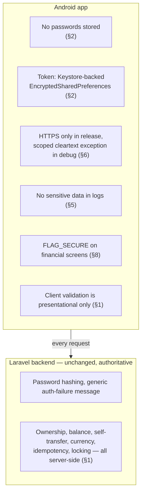

# NovaPay Android — Security

This is a fintech client. Every decision below is stated as **Problem →
Decision → Reason**, per the brief's requirement to explain security choices
rather than assert them.

---

## 1. The backend is the financial authority — restated as a security rule

**Problem:** it's tempting to make the client "smarter" by pre-validating
balances, transfer rules, or amounts to give faster feedback.
**Decision:** the Android app performs only *presentational* validation
(non-empty fields, a plausible email shape, a positive amount) — it never
treats a client-side check as authorization or as the actual answer to "is
this transfer allowed."
**Reason:** every real rule (ownership, balance, self-transfer, currency
match, idempotency) is enforced server-side under a database transaction and
row locks (`existing-system-analysis.md` §9). A client-side check that
happened to agree with the server would be redundant; one that disagreed
would either block a legitimate action or, worse, give the user false
confidence in a number that changed the instant a real check would matter
(a race with a concurrent request). Treating the UI as authoritative for
money movement is exactly the class of mistake this rule exists to prevent.

---

## 2. Token storage

**Problem:** the app must hold a long-lived Sanctum bearer token
(`existing-system-analysis.md` §3.4 — no expiry, no refresh flow) somewhere
on-device, readable on every request, but never readable by another app or
easily extracted from a backup/rooted device.
**Decision:** `androidx.security:security-crypto`'s `EncryptedSharedPreferences`,
backed by a Keystore-generated `MasterKey` (AES256-GCM), storing exactly one
value: the bearer token. No custom crypto is written — the Jetpack Security
library exists specifically so app developers don't hand-roll AES/IV/key-
storage code, which is a well-known source of real-world vulnerabilities
(hardcoded IVs, keys shipped in the APK, etc.).
**Reason this over alternatives:**
- Plain `SharedPreferences` (Flutter's `SecureStorageService` avoids this for
  the same reason — see its own doc comment) writes an unencrypted XML file;
  any app with root, or a backup-extraction tool, can read it directly.
- `Room`/SQLite with a hand-rolled encryption layer is strictly more code and
  more attack surface than a maintained, audited library for a single
  key-value pair — this is exactly the "unnecessary local database usage"
  the brief warns against.
- The Keystore-backed key never leaves secure hardware (or a software-backed
  Keystore fallback on devices without one) — the app process itself never
  holds the raw AES key in a form that a memory dump could trivially recover
  it from, unlike a key derived from a hardcoded string.

**What is never stored locally, under any mechanism:** the password (never
persisted anywhere — it exists only transiently in a `TextFieldValue` on the
Login/Register screen and in the single outgoing HTTPS request body), and
there is no PIN/biometric secret to store since neither is a real,
server-verified feature in this backend (`existing-system-analysis.md` §11 —
the Settings "Biometric Login" toggle persists a boolean preference only,
identically to the Flutter reference, and gates nothing).

---

## 3. Backup exclusion

**Problem:** Android's Auto Backup (and, from API 31+, the more granular
`dataExtractionRules`) can include app-private files in a cloud/ADB backup
by default.
**Decision:** an explicit `data_extraction_rules.xml` (API 31+) and
`backup_rules.xml` (pre-31 fallback) excluding the `EncryptedSharedPreferences`
file from both cloud backup and device-to-device transfer.
**Reason:** even though the file's contents are encrypted, the Keystore key
protecting it is hardware/OS-bound and does **not** transfer with a backup —
a restored copy of the encrypted file on a new device would just be
undecryptable garbage, not a usable token. Excluding it isn't about
preventing decryption (the OS already does that); it's about not shipping a
stale, meaningless blob at all and keeping backup payloads minimal, which is
standard practice for anything credential-adjacent.

---

## 4. What's cached locally, and why

| Data | Where | Why | Expiry / staleness handling |
|---|---|---|---|
| Bearer token | `EncryptedSharedPreferences` (§2) | Required for every authenticated request without re-login on every launch | Cleared on logout or a confirmed `401` (`authentication-flow.md` §2, §5) — never time-based, since the backend itself has no token expiry |
| Settings toggles (push/transaction alerts, biometric-login preference, dark mode) | Jetpack `DataStore<Preferences>`, unencrypted | Non-sensitive UI preferences, identical in kind to the Flutter reference's `SharedPreferences`-backed `LocalStorageService` | No expiry — these are device-local settings with no backend counterpart (`existing-system-analysis.md` §11) |
| Wallet balances, transactions, user profile | **Not persisted** — held only in in-memory `StateFlow` for the current app session | This is financial data the backend can change server-side at any moment (another device transfers money, a top-up completes); a stale local copy is actively misleading, not a convenience | Re-fetched on every screen entry / pull-to-refresh / after a mutating request (§4 of `wallet-flow.md`) |

**No Room database exists in this app.** There is no feature whose data
genuinely needs offline querying, relational joins, or persistence across
app restarts beyond the four Settings booleans — introducing Room here would
be exactly the "unnecessary local database usage" the brief warns against,
and would create a second, harder-to-reason-about source of truth for data
whose only correct source is the server.

---

## 5. Logging

**Problem:** debug logging is genuinely useful during development but is a
common, real-world source of credential/PII leaks (Logcat output ends up in
bug reports, crash tooling, screen recordings of a connected device).
**Decision** (detailed in `api-integration.md` §6):
- `HttpLoggingInterceptor` exists only in debug builds, at `BASIC` level
  (method/URL/status/size), never `BODY` level by default.
- The `Authorization` header is explicitly redacted even in debug logs.
- No application code ever logs a password, token, email, wallet balance, or
  transaction amount, at any log level, in any build type — this is a rule
  enforced by code review discipline (and, where practical, a lint check),
  not just a default library setting.
- Release builds strip `Log.d`/`Log.v` calls entirely via R8 (standard
  ProGuard rules removing verbose/debug log calls from release bytecode),
  so even an accidentally-added debug log line cannot ship to production.

---

## 6. Transport security

- **HTTPS only in release builds** — `usesCleartextTraffic="false"`, no
  exceptions (`api-integration.md` §5).
- **Debug builds** allow cleartext to exactly one host (the emulator's
  `10.0.2.2` alias, or a developer's own LAN IP override), via a scoped
  `network_security_config.xml` — never a blanket allowance, and this
  configuration does not exist in the release manifest variant at all.
- **Certificate pinning is not implemented in this version** — there is no
  real production Laravel deployment to pin a certificate to yet
  (`api-integration.md` §2's release `BASE_URL` is a documented placeholder).
  Listed explicitly in `implementation-plan.md`'s future-improvements list
  rather than pinning a certificate that corresponds to nothing real.

---

## 7. Input fields

- The password field uses Compose's `PasswordVisualTransformation` and a
  `KeyboardOptions`/`autofill` content type of `Password` — this lets the
  platform's password manager (and, if the user has one, a third-party
  password manager) offer to save/fill it correctly, which is a real
  security benefit (encourages strong, unique, manager-generated passwords)
  rather than a cosmetic choice.
- No custom keyboard, no custom clipboard handling, no
  `TextField`-level workaround that would fight the platform's normal
  autofill/security behavior.

---

## 8. Screenshot / screen-recording exposure on financial screens

**Problem:** Android allows any app to be screen-recorded or have a
screenshot taken by default, including by the OS's own recent-apps preview.
**Decision:** `FLAG_SECURE` is set on the small set of screens that display a
full balance, a completed transaction's amount, or a confirmation about to
move money — the Confirm/Result screens for Top-up and Transfer, and the
Wallet tab's balance card view — preventing screenshots, screen recording,
and the recent-apps thumbnail from capturing them.
**Reason this is a real security control, not UI theater:** the brief
explicitly warns "never assume that hiding something in the Android UI is a
security control" — `FLAG_SECURE` is not hiding data in the UI, it's an
OS-enforced restriction on the composited output of the window itself,
equivalent in category to how banking and password-manager apps commonly use
it. It is **not** used as a substitute for the actual authorization checks
in §1 — it only reduces one specific, real exposure (a screenshot or screen
recording capturing a balance/transaction), and is called out explicitly as
an addition beyond what the Flutter reference does (which has no equivalent
control), since it costs one line per sensitive screen and has no downside
for this app's UX.

---

## 9. Deliberately out of scope, and why

| Not implemented | Reason |
|---|---|
| Root/jailbreak detection, device-integrity attestation | Not requested by the brief, adds real complexity and false-positive risk (legitimate custom ROMs, work-profile devices), and doesn't correspond to any backend-enforced policy today — would be security theater without a server-side counterpart to actually act on it |
| Certificate pinning | No real production TLS endpoint exists yet to pin (§6) |
| Biometric-gated app unlock | The Settings toggle exists only as a local preference, exactly mirroring the Flutter reference (`existing-system-analysis.md` §11) — implementing a real `BiometricPrompt` gate would be a genuine feature addition beyond what either the brief's auth section or the reference app asks for, and is listed as a future improvement rather than silently added |
| Refresh tokens / token rotation | The backend issues a single long-lived Sanctum PAT with no refresh endpoint (`existing-system-analysis.md` §3.4) — inventing a refresh flow client-side would not correspond to anything the server actually supports |

---

## 10. Summary: security decisions at each layer

