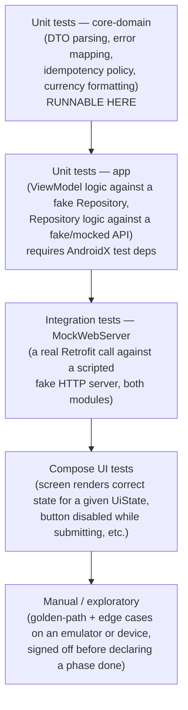

# NovaPay Android — Testing Plan

---

## 1. What can actually be verified in this build environment — read this first

This project is being developed in a sandboxed container (`android-architecture.md`
§4) with:
- **No Android SDK installed**, and
- **`dl.google.com` (Google's Maven repository — every AndroidX artifact, Compose,
  and the Android Gradle Plugin itself) blocked by organizational egress
  policy** — confirmed via a direct `403` and the proxy's own diagnostic
  explicitly instructing not to route around it.
- Maven Central (`repo1.maven.org`) **is** reachable — this covers Kotlin
  stdlib, kotlinx.serialization, kotlinx.coroutines, Retrofit, OkHttp
  (incl. MockWebServer), JUnit5, MockK, and Turbine.

**Consequence, stated plainly:** the `:app` module (Compose UI, Hilt,
Android platform code) cannot be compiled, unit-tested, or instrumented-
tested in this environment — that requires a machine with normal internet
access (a developer's own machine with Android Studio, or a CI runner with
standard Google Maven access). Nothing in this project claims otherwise.

**What genuinely is compiled and tested here:** the `core-domain` module —
DTOs, the Retrofit API interfaces, the idempotency-key generator, the
currency formatter, and the HTTP-error mapper — is a plain `kotlin("jvm")`
module with zero AndroidX dependency, and its test suite runs for real via
`./gradlew :core-domain:test` against JUnit5/MockK/MockWebServer, all from
Maven Central. This is deliberately where the highest financial-correctness
risk lives (`android-architecture.md` §4), so it is also where "verified,
not just written" actually means something concrete in this environment.

| Layer | Compiled here? | Unit-tested here? | Requires normal internet access |
|---|---|---|---|
| `core-domain` (DTOs, API interfaces, error mapper, idempotency policy, currency formatter) | **Yes** | **Yes** — real JUnit run | No |
| `app` — ViewModels, Compose UI, Hilt graph, Navigation | No | No (would need `androidTest`/Robolectric with AndroidX, unavailable here) | Yes |
| Instrumented/UI tests (Compose testing APIs, an emulator or device) | No | No | Yes, plus a device/emulator |

The final verification checklist (`implementation-plan.md`'s last phase)
distinguishes "ran in this session, with output shown" from "written
correctly and structurally sound, to be run on a machine with SDK access" —
never conflating the two.

---

## 2. Testing pyramid for this app

Most weight is on the bottom two layers — this is a small app with a handful
of screens, not a place where an extensive UI-test suite pays for itself;
the brief itself says not to over-engineer. Financial-logic correctness
(idempotency, error mapping, amount/currency handling) is unit-tested
exhaustively; UI is verified by a mix of a small number of Compose tests for
the state-rendering contracts that matter (loading/error/empty/disabled-
while-submitting) and manual verification on an emulator, per Part 20's
"implement the approved phase → test it → explain the result" workflow.

---

## 3. Tools

| Purpose | Tool | Notes |
|---|---|---|
| Test runner | JUnit 5 (Jupiter) | |
| Mocking | MockK | Kotlin-first, avoids Mockito's reflection issues with `data class`/`final` |
| Flow testing | Turbine | For asserting on `StateFlow`/`Channel` emissions from ViewModels |
| Coroutine testing | `kotlinx-coroutines-test` (`runTest`, `TestDispatcher`) | |
| Fake HTTP server | OkHttp `MockWebServer` | Scripts real HTTP responses (status, body, headers) against a real Retrofit client — used for `core-domain` API-interface tests and `app`-module repository tests alike |
| Compose UI testing | `androidx.compose.ui:ui-test-junit4` | Requires AndroidX — not runnable in this sandbox (§1), written for CI/local execution |

---

## 4. Top-up test matrix (Part 18's required cases, mapped to actual tests)

| Case | Test | Layer |
|---|---|---|
| Valid amount, USD | `TopUpApiTest.submitTopUp_success_returns201WithTransaction` (MockWebServer scripts `201`) | `core-domain` |
| Valid amount, KHR | Same test, parameterized over `Currency.KHR` — asserts 0-decimal formatting is round-tripped correctly in the request body | `core-domain` |
| Invalid amount (0, negative, non-numeric) | `TopUpViewModelTest.submit_withZeroAmount_doesNotCallRepository` — the button-disabled/no-op path, and `AmountFieldValidatorTest` for the presentational check itself | `app` (ViewModel), `core-domain` (validator) |
| Invalid currency | `TopUpApiTest.submitTopUp_serverRejectsCurrency_mapsTo422` (MockWebServer scripts a `422` for an out-of-enum currency the client shouldn't be able to select anyway, defensively) | `core-domain` |
| Duplicate request (same key, submitted twice) | `TopUpRepositoryTest.retryWithSameKey_returnsOriginalTransaction_doesNotResubmitDifferentBody` — asserts the second call sends an identical body and the repository surfaces the (idempotent) `200` result the same as a `201` | `app`/`core-domain` |
| Retry with same idempotency key | `TopUpViewModelTest.submitFailsThenRetried_reusesSameIdempotencyKey` (Turbine asserts `uiState.idempotencyKey` unchanged across the two `submit()` calls) | `app` |
| Changed amount creates new key | `TopUpViewModelTest.amountChanged_generatesNewIdempotencyKey` | `app` |
| Changed currency creates new key | `TopUpViewModelTest.currencyChanged_generatesNewIdempotencyKey` | `app` |
| Failed request (network/timeout) | `TopUpRepositoryTest.submitTopUp_ioException_mapsToNetworkError` | `core-domain`/`app` |
| Successful response | `TopUpViewModelTest.submitSucceeds_emitsNavigateToResultEffect_andRefreshesWallet` (Turbine) | `app` |

---

## 5. Transfer test matrix (Part 18's required cases, mapped to actual tests)

| Case | Test | Layer |
|---|---|---|
| Valid transfer | `TransferApiTest.submitTransfer_success_returns201` | `core-domain` |
| Recipient not found | `TransferRepositoryTest.findRecipient_404_mapsToNotFoundError`; `TransferViewModelTest.submit_recipientNotFound_showsServerMessage` | `core-domain`/`app` |
| Self-transfer | `TransferApiTest.submitTransfer_selfTransfer_returns422WithFlatMessageShape` — specifically asserts the **flat** `{message}` shape (no `errors` key) is still surfaced correctly, since it's structurally different from every other `422` this backend returns (`existing-system-analysis.md` §4.1) | `core-domain` |
| Insufficient balance | `TransferApiTest.submitTransfer_insufficientBalance_returns422WithFieldError` (asserts `errors.amount` is read and shown, not swallowed) | `core-domain` |
| Same-currency transfer (both wallets exist) | `TransferApiTest.submitTransfer_matchingCurrencyBothSides_succeeds` | `core-domain` |
| Missing recipient wallet (currency mismatch) | `TransferApiTest.submitTransfer_currencyMismatch_returns422WithFieldError` (`errors.currency`) | `core-domain` |
| Duplicate request | `TransferRepositoryTest.retryWithSameKey_returnsOriginalTransaction` | `app`/`core-domain` |
| Retry behavior | `TransferViewModelTest.submitFailsThenRetried_reusesSameIdempotencyKey`; `.recipientOrAmountOrCurrencyOrNoteChanged_generatesNewIdempotencyKey` (four parameterized cases) | `app` |
| Server validation errors (general) | `ErrorMapperTest.http422WithErrorsMap_mapsAllFieldErrors`; `.http422FlatShape_mapsToGeneralMessage` | `core-domain` |

---

## 6. What is deliberately *not* over-tested

- No test asserts pixel-level Compose layout — only that the correct
  composable/state is rendered for a given `UiState` (e.g. "the error text
  is visible when `LoadState.Error`", not "the error text is 14sp").
- No snapshot/screenshot testing framework is introduced — this app's visual
  surface is small enough that manual review during each phase (Part 20's
  workflow) is sufficient and doesn't warrant the added CI complexity and
  flakiness screenshot testing tends to bring.
- No end-to-end test drives a real Laravel instance from the Android test
  suite — `MockWebServer` scripting the documented contract
  (`existing-system-analysis.md` §4) is the right boundary; a true E2E run
  against a live backend is a manual verification step (Part 20/`implementation-plan.md`'s
  final phase), not an automated CI test, since it would require standing up
  and seeding a real MySQL-backed Laravel instance as a test dependency.
