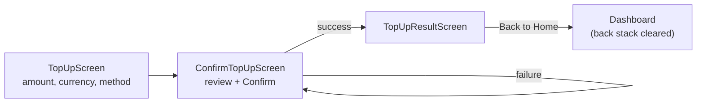

# NovaPay Android — Top-up Flow

Backend contract: `existing-system-analysis.md` §4, §8. This document owns
the idempotency-key policy in full detail, since it's the single most
important correctness property of this flow and the brief asks for an
explicit explanation of the "reuse vs. regenerate" rule.

---

## 1. Screens



Three screens, one shared `TopUpViewModel` (scoped to the top-up nav
sub-graph so all three screens see the same `UiState` — no data is
re-fetched or re-entered between screens). This matches the Flutter
reference's single `topUpProvider` read by all three of
`TopUpScreen`/`ConfirmTopUpScreen`/`TopUpResultScreen`.

---

## 2. Request flow

```mermaid
sequenceDiagram
    participant U as User
    participant VM as TopUpViewModel
    participant Repo as TopUpRepository
    participant API as Laravel

    VM->>API: GET /payment-methods (on TopUpScreen entry)
    API-->>VM: {methods: [linkedBank, debitCard, applePay]}
    U->>VM: amount / currency / method changes
    VM->>VM: idempotencyKey = UUID.randomUUID() (see §3)
    U->>VM: "Confirm Top-up" (on ConfirmTopUpScreen)
    VM->>VM: uiState = uiState.copy(isSubmitting = true)
    VM->>Repo: submitTopUp(amount, currency, method, idempotencyKey)
    Repo->>API: POST /topups {amount, currency, method, idempotency_key}
    alt success (new or idempotent replay)
        API-->>Repo: 201 or 200 {transaction}
        Repo-->>VM: Result.success(transaction)
        VM->>VM: walletRepository.refresh(); isSubmitting = false
        VM-->>U: effect NavigateToResult(transaction)
    else failure
        API-->>Repo: 4xx / 5xx / network error
        Repo-->>VM: Result.failure(appError)
        VM->>VM: isSubmitting = false; uiState.error = message
        Note over VM: idempotencyKey is NOT regenerated on failure — see §3
        VM-->>U: inline error, stay on ConfirmTopUpScreen, button re-enabled
    end
```

**Payment methods are cosmetic**, not a real payment rail —
`existing-system-analysis.md` §8 explains this is a hardcoded list on the
backend, not a database table or a real processor integration. The UI treats
it accordingly: a selectable list with an icon and description, nothing that
implies a real card/bank charge is happening.

---

## 3. Idempotency key: exact lifecycle and why

```kotlin
data class TopUpUiState(
    val amount: String = "",
    val currency: Currency = Currency.USD,
    val selectedMethod: PaymentMethodType? = PaymentMethodType.LinkedBank,
    val idempotencyKey: String = UUID.randomUUID().toString(),
    // ...
)

fun onEvent(event: TopUpEvent) {
    when (event) {
        is TopUpEvent.AmountChanged ->
            _uiState.update { it.copy(amount = event.raw, idempotencyKey = newKey()) }
        is TopUpEvent.CurrencySelected ->
            _uiState.update { it.copy(currency = event.currency, idempotencyKey = newKey()) }
        is TopUpEvent.MethodSelected ->
            _uiState.update { it.copy(selectedMethod = event.method, idempotencyKey = newKey()) }
        TopUpEvent.Submit -> submit()   // does NOT touch idempotencyKey
    }
}
```

**Rule:** one idempotency key per *logical top-up attempt*. A logical attempt
is defined by the triple `(amount, currency, method)` — the exact fields the
backend's `POST /topups` body carries and the exact fields
`UNIQUE(idempotency_key, type)` is meant to protect. Concretely:

- **A new key is generated the moment any of `amount`, `currency`, or
  `method` changes.** If the user changes their mind about the amount before
  submitting, that's a genuinely different request — reusing the old key
  would be *wrong*, not just unnecessary: if the first (never-submitted)
  key happened to reach the server through some other path, the server would
  have no way to know the user actually meant the new amount. Each distinct
  request body gets its own key, one-to-one.
- **The key is reused, unchanged, across a retry of the identical request.**
  If `submit()` fails — timeout, dropped connection, 500 — the amount,
  currency, and method the user is looking at on `ConfirmTopUpScreen` have
  not changed, so tapping "Confirm Top-up" again is *the same logical
  attempt*, not a new one. Reusing the key is what makes that retry safe:
  if the first attempt actually reached the server and succeeded (the client
  just never saw the response — e.g. the connection died after the server
  committed but before the response arrived), the retry hits
  `Transaction::where('idempotency_key', $key)->first()`'s fast path on the
  backend (`existing-system-analysis.md` §8) and gets the *original* result
  back — the wallet is never incremented twice.
- **This is exactly the Flutter reference's behavior**, verified in
  `TopUpNotifier` (`setAmount`/`setCurrency`/`selectMethod` all call
  `_uuid.v4()`; `submit()` does not) — Android reproduces the same
  granularity deliberately, not by coincidence.

**What Android does differently, and why it's a fix, not a deviation:** the
Flutter reference sets `submitting: false` at the *start* of `submit()`
(a verified bug — `existing-system-analysis.md` §2.5), so the Confirm
button's loading/disabled state never actually activates during the real
network call, leaving a live (if idempotency-protected) double-submit
surface. Android sets `isSubmitting = true` before the request and disables
the Confirm button for the duration — the idempotency key is still the real
safety net (defense in depth, matching the brief's Part 14 requirement that
"buttons cannot accidentally trigger duplicate money operations"), but the
button itself now actually prevents the easy case instead of relying solely
on the server-side guarantee.

---

## 4. Result screen

`TopUpResultScreen` renders `balanceAfter` and `id` **verbatim from the
`TransactionDto` the server returned** — never recomputed as
"old balance + amount" client-side. This matters because on an idempotent
replay, `balanceAfter` is the balance from the *original* successful attempt,
which is the only value that's actually correct; a client-side recomputation
based on a possibly-stale locally-cached balance could show the wrong number
even though the server did the right thing.

---

## 5. States

| State | Rendering |
|---|---|
| Loading payment methods | Spinner in the "Choose Method" section |
| Payment methods failed to load | Inline message + Retry (identical text/action to the Flutter reference: "Could not load payment methods." / "Retry") |
| Amount = 0 or empty | "Review Top-up" / "Confirm Top-up" button disabled — presentational only, not a substitute for the backend's `min:0.01` validation |
| Submitting | Button shows a spinner, is disabled (§3) |
| Submit failed | Inline error (snackbar), same screen, same idempotency key retained, button re-enabled |
| Submit succeeded | Navigate to `TopUpResultScreen`, back stack does **not** allow returning to `ConfirmTopUpScreen` (the confirm screen is popped, not just covered — mirrors `Navigator.pushReplacement` in the Flutter reference) |
