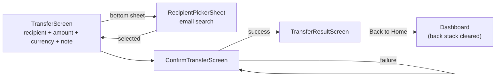
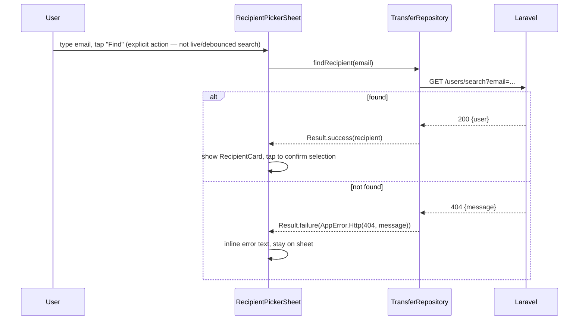
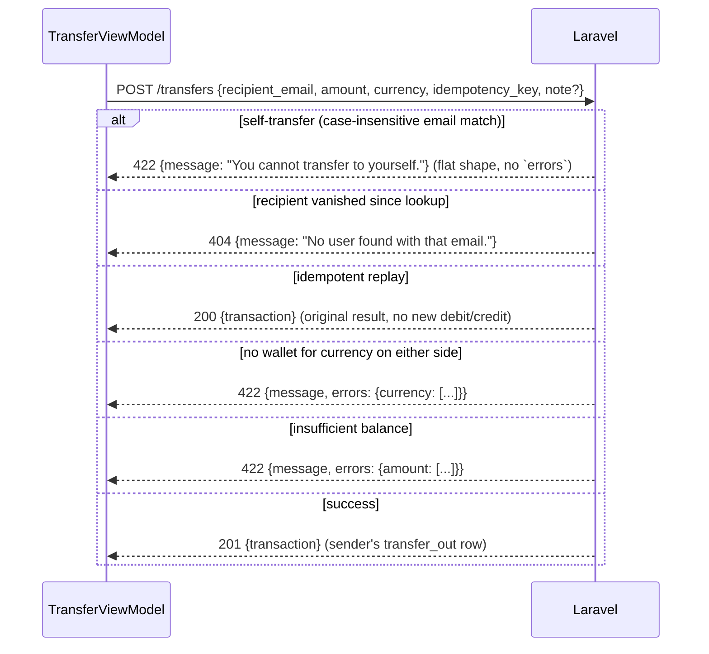

# NovaPay Android — Transfer Flow

Backend contract: `existing-system-analysis.md` §4, §9. The idempotency-key
policy here is identical in *mechanism* to Top-up (`topup-flow.md` §3) —
this document focuses on what's unique to Transfer: recipient lookup, and
the ordered set of server-side rejections Android must surface distinctly.

---

## 1. Screens

One `TransferViewModel` shared across all screens in this flow, same
rationale as `topup-flow.md` §1.

---

## 2. Recipient lookup

**Deliberately an explicit "Find" button, not live-as-you-type search** —
this matches the Flutter reference's `RecipientPickerSheet` exactly
(`existing-system-analysis.md`'s inspection of `_search()`, triggered by
button tap or IME submit only). It's also the *correct* UX for this specific
backend: `GET /users/search` is an **exact-email-match** lookup, not a
fuzzy/prefix search — there is nothing useful to show after each keystroke,
and firing a network request per character would be pure waste against an
endpoint that can only ever return one exact result or a 404.

---

## 3. Submit flow, in the order the backend actually checks things

`existing-system-analysis.md` §9 documents the exact server-side check
order; Android's error handling is built to distinguish every one of these
distinctly rather than collapsing them into one generic "transfer failed"
message, since each implies different user-facing copy and, in one case
(insufficient balance), a materially different next action for the user:

Android's `TransferViewModel` does not attempt to pre-empt any of these
client-side beyond disabling the submit button for an obviously-incomplete
form (no recipient selected, amount ≤ 0) — every one of the five outcomes
above is read from the actual response and rendered with its actual
`message`, per the mapping in `api-integration.md` §4. In particular:
**Android never blocks a submission because a locally-cached balance looks
insufficient** — the balance check only happens once, server-side, under a
row lock, at the moment of the actual debit (`existing-system-analysis.md`
§9 rule 4), because that's the only place a stale client-side number can't
cause a false negative or a false positive under concurrent activity.

---

## 4. Idempotency key

Identical mechanism to Top-up (`topup-flow.md` §3), scoped to the fields
that define a transfer request: the key regenerates on any change to
**recipient, amount, currency, or note**, and stays fixed across a
failed-then-retried submit. Verified against `TransferNotifier` in the
Flutter reference (`setRecipient`/`setAmount`/`setCurrency`/`setNote` each
call `_uuid.v4()`; `submit()` does not) — same granularity, same reasoning:
a transfer with a different note is a different logical request even if the
amount/recipient/currency are unchanged, because the backend's
`description` field (and thus the transaction record itself) would differ.

The same "fix, not deviation" note from `topup-flow.md` §3 applies here too:
the reference's `submitting: false`-never-`true` bug is present in
`TransferNotifier` as well, and Android fixes it the same way (button
disabled for the actual duration of the request).

---

## 5. Result screen

`TransferResultScreen` shows `transaction.balanceAfter` — the **sender's**
post-transfer balance, since `POST /transfers` only ever returns the
sender's `transfer_out` row (`existing-system-analysis.md` §4.2). The
recipient's side of the transfer is never shown here; the recipient sees
their own `transfer_in` row the next time *they* open their own transaction
history — Android does not attempt to show or infer the recipient's balance,
since the API never exposes it to the sender and doing so would mean
guessing at data the client has no right to see.

---

## 6. States

| State | Rendering |
|---|---|
| No recipient selected | `RecipientSelectPrompt` placeholder ("Select recipient" + chevron), Continue disabled |
| Recipient selected | `RecipientCard` (avatar initials, name, email) |
| Recipient search: no results | Inline error text in the sheet, sheet stays open |
| Recipient search: in flight | "Find" button shows a small spinner, disabled |
| Amount ≤ 0 | Continue disabled — presentational only |
| Submitting | Confirm button spinner + disabled (§4) |
| Self-transfer / recipient-not-found / currency-mismatch / insufficient-balance | Red snackbar with the exact server message (matches the Flutter reference's red, icon-prefixed snackbar style for transfer errors specifically, distinct from Top-up's plain snackbar) |
| Success | Navigate to `TransferResultScreen`, `ConfirmTransferScreen` popped (not just covered) |
