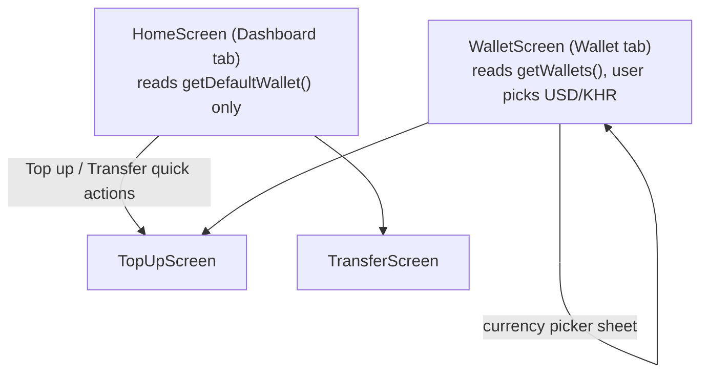

# NovaPay Android — Wallet Flow

Backend contract: `existing-system-analysis.md` §4, §6. Covers the Wallet
tab, the Dashboard's balance card, and how currency selection propagates
into Top-up/Transfer.

---

## 1. Data shape

Every user has exactly two wallets after registration — USD (`is_default =
true`) and KHR (`is_default = false`) — and the Android app never offers UI
to create a third. `WalletRepository` exposes both reads the backend
actually provides:

```kotlin
interface WalletRepository {
    suspend fun getDefaultWallet(): Result<WalletDto, AppError>   // GET /wallets/default
    suspend fun getWallets(): Result<List<WalletDto>, AppError>   // GET /wallets
}
```

No client-side "switch active wallet" call exists because none exists on the
backend — currency selection is local UI state that changes *which* of the
two already-fetched wallets is being displayed, and which `currency` value
is sent on the next Top-up/Transfer request. This mirrors the Flutter
reference's `_selectedCurrency` (`WalletScreen`)/`state.currency`
(`TopUpState`/`TransferState`) exactly — see
`existing-system-analysis.md` §6.

---

## 2. Screens



- **`HomeScreen`** shows the default (USD) wallet's balance only — same as
  `HomeDashboardScreen` in Flutter, which renders `walletProvider` (singular)
  regardless of what currency was last picked on the Wallet tab. The two
  tabs' currency selection are independent; picking KHR on the Wallet tab
  does not change what Home shows.
- **`WalletScreen`** shows a currency chip (`USD ▾` / `KHR ▾`) that opens a
  bottom sheet listing both wallets; selecting one re-renders the balance
  card and re-fetches that currency's transaction history
  (`feature/transactions`, §3 of `wallet-flow.md`'s sibling doc
  `topup-flow.md`/`transfer-flow.md` for how the same picker pattern is
  reused there).

---

## 3. Effect of the selected currency

| Consumer | What changes |
|---|---|
| Balance display | Read from the matching `WalletDto` in the already-fetched `getWallets()` list — no extra network call just to switch the displayed currency |
| Transaction history | `feature/transactions` is asked for that specific `currency`'s paginated list (`GET /wallets/{currency}/transactions`) instead of the default-wallet endpoint |
| Top-up | `currency` field in the request body; also resets the quick-amount chips (USD: 25/50/100/250 — KHR: 20000/50000/100000/200000, identical to `TopUpNotifier.quickAmountsByCurrency`) and regenerates the idempotency key (`topup-flow.md` §3) |
| Transfer | `currency` field in the request body; the backend independently resolves **both** sender's and recipient's wallet for that currency and rejects if either is missing (`existing-system-analysis.md` §9 rule 3) — Android surfaces that specific `422` if it ever happens rather than assuming it can't |

---

## 4. Refresh after a mutation

`WalletRepository` is the single owner of wallet data; after a successful
Top-up or Transfer, the submitting ViewModel calls
`walletRepository.refresh()` (re-runs `getWallets()`/`getDefaultWallet()` and
re-emits) before navigating to the result screen — the direct equivalent of
the Flutter reference's `ref.invalidate(walletProvider)` /
`ref.invalidate(walletsProvider)` calls in `ConfirmTopUpScreen`/
`ConfirmTransferScreen`. This is why the Result screen's "New Balance" is
never stale by the time the user navigates back to Home/Wallet.

---

## 5. States

| State | Rendering |
|---|---|
| Loading | Skeleton/spinner in place of the balance card, quick actions still visible but disabled (matches Flutter's `CircularProgressIndicator` in the balance-card slot while quick actions remain tappable) |
| Error | "Unable to load wallet" inline in the balance-card area + Retry — never a full-screen error replacing the whole tab, since the rest of the screen (nav, header) still works |
| Success, 1 wallet fetched but not 2 | Defensive case, not expected given registration always creates both — if it ever occurs, the currency picker simply shows one option instead of crashing |
| Success | Balance card + currency chip (Wallet tab only) |
